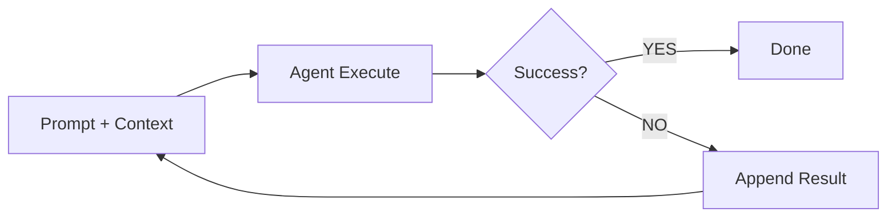
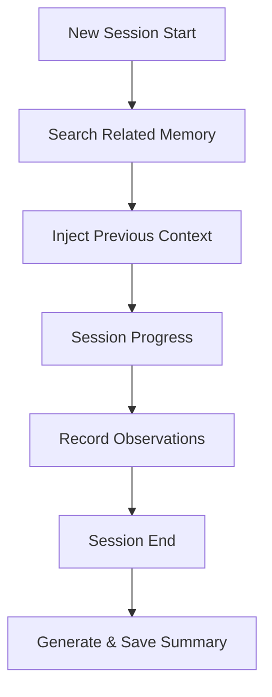
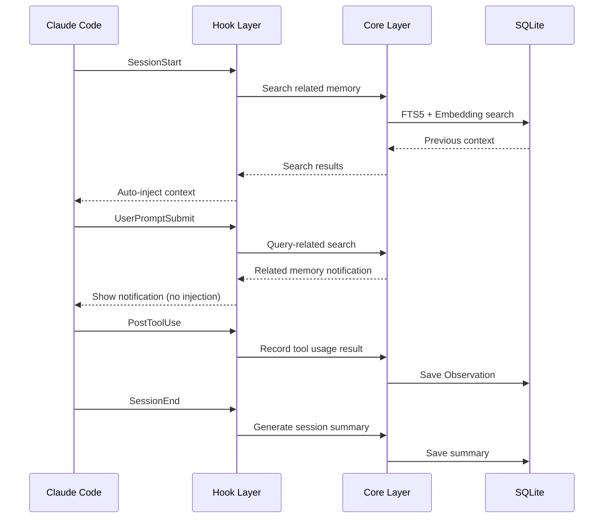
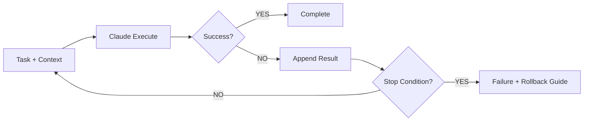
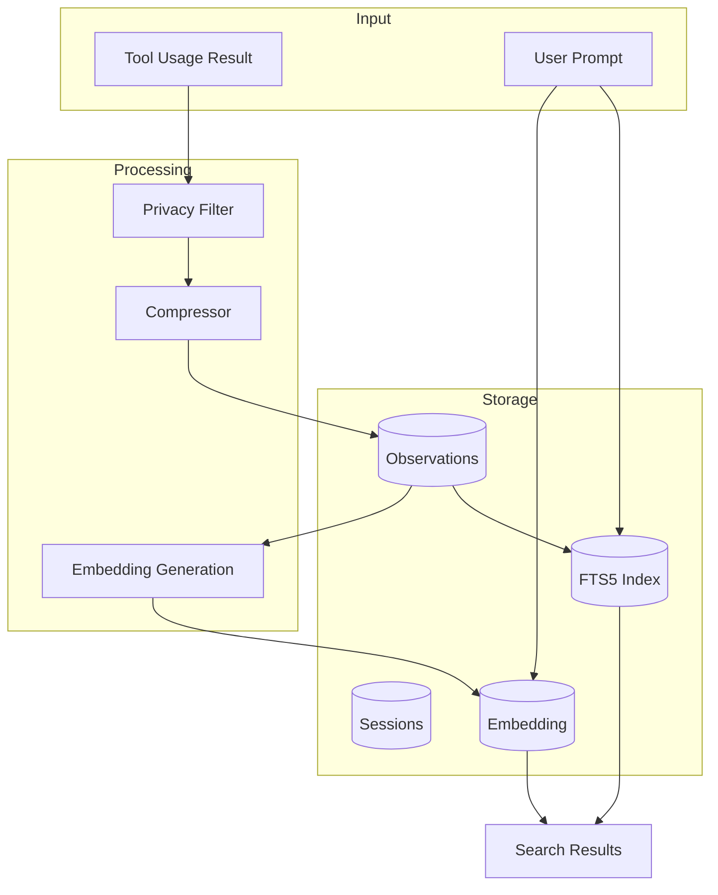
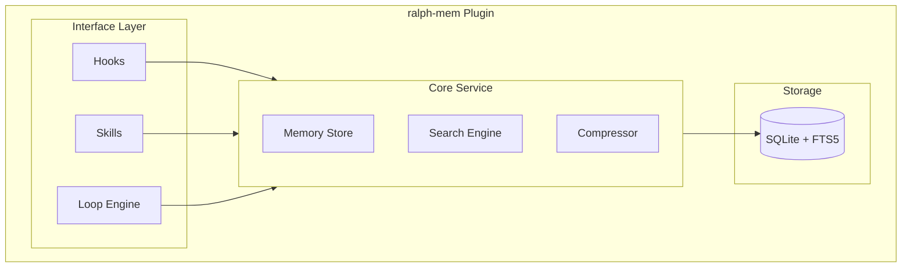

# ralph-mem

[](https://www.npmjs.com/package/ralph-mem)
[](https://opensource.org/licenses/MIT)
[](https://www.typescriptlang.org/)
[](https://bun.sh/)

A persistent context management plugin for Claude Code based on Ralph Loop

**[한국어 문서 (Korean)](./README.ko.md)**

## Overview

ralph-mem is a project inspired by [Geoffrey Huntley](https://ghuntley.com/)'s [Ralph Loop](https://ghuntley.com/ralph/) and [thedotmack](https://github.com/thedotmack)'s [claude-mem](https://github.com/thedotmack/claude-mem).

It combines Ralph Loop's "repeat until success" philosophy with claude-mem's "intelligent context management" to implement a persistent memory management plugin for Claude Code.

### Problems Solved

| Problem           | Description                                                   |
| ----------------- | ------------------------------------------------------------- |
| **Context Rot**   | Model performance degradation due to accumulated irrelevant info |
| **Compaction**    | Output quality drops sharply when context window exceeds 60-70% |
| **Forgetfulness** | Loss of work context between sessions                         |
| **One-shot Failure** | Low success rate for complex tasks in single attempts      |

## Key Features

### 1. Ralph Loop Engine

Automatically repeats execution until success criteria are met.

```bash
/ralph start "Add user authentication with JWT"
```



**Supported Success Criteria:**

- `test_pass` - Tests pass (`npm test`, `pytest`)
- `build_success` - Build succeeds
- `lint_clean` - No lint errors
- `type_check` - Type check passes
- `custom` - User-defined command

### 2. Persistent Memory

Automatically saves and restores context between sessions.



**Lifecycle Hooks:**

- `SessionStart` - Automatically inject related memory
- `PostToolUse` - Record tool usage results
- `Stop` - Cleanup on forced session termination
- `SessionEnd` - Generate and save session summary

### 3. Progressive Disclosure

Token-efficient 3-layer search saves ~10x tokens:

| Layer   | Content                    | Tokens          |
| ------- | -------------------------- | --------------- |
| Layer 1 | Index (ID + score)         | 50-100/result   |
| Layer 2 | Timeline (chronological)   | 200-300/result  |
| Layer 3 | Full Details               | 500-1000/result |

```bash
/mem-search "authentication error"           # Layer 1
/mem-search --layer 3 obs-a1b2               # Layer 3
```

## Installation

### npm

```bash
npm install ralph-mem
```

### yarn

```bash
yarn add ralph-mem
```

### pnpm

```bash
pnpm add ralph-mem
```

### bun

```bash
bun add ralph-mem
```

### Claude Code Plugin

To use as a Claude Code plugin, install via the [roboco-io/plugins](https://github.com/roboco-io/plugins) marketplace:

1. Add marketplace
```
/plugin marketplace add roboco-io/plugins
```

2. Install plugin
```
/plugin install ralph-mem@roboco-plugins
```

Or open the plugin manager with `/plugin` command to install via UI.

### Plugin Update

1. Update marketplace
```
claude plugin marketplace update roboco-plugins
```

2. Update plugin
```
claude plugin update ralph-mem@roboco-plugins
```

Restart Claude Code after update to apply changes.

## Usage

### Ralph Loop

```bash
# Start loop (default: until tests pass)
/ralph start "Implement feature X"

# Start with custom success criteria
/ralph start "Fix lint errors" --criteria lint_clean

# Check loop status
/ralph status

# Stop loop
/ralph stop
```

### Memory Search

```bash
# Keyword search
/mem-search "JWT authentication"

# Get specific observation details
/mem-search --layer 3 <observation-id>

# Search with time range
/mem-search "database" --since 7d
```

### Memory Management

```bash
# Check memory status
/mem-status

# Manual context injection
/mem-inject "This project uses Express + Prisma"

# Remove specific memory
/mem-forget <observation-id>
```

### 4. Privacy Features

Excludes sensitive information from memory.

**`<private>` tag:**

```bash
# Content wrapped in tags is not stored
My API key is <private>sk-1234567890</private>
# Stored as: My API key is [PRIVATE]
```

**Configuration-based exclusion:**

```yaml
privacy:
  exclude_patterns:
    - "*.env"
    - "*password*"
    - "*secret*"
```

### 5. MCP Tools

In addition to skills, memory can be accessed via MCP (Model Context Protocol) tools.

| Tool | Description |
|------|-------------|
| `ralph_mem_search` | Progressive Disclosure-based search |
| `ralph_mem_timeline` | Chronological context around specific observation |
| `ralph_mem_get` | Full details by observation ID |

## Configuration

`~/.config/ralph-mem/config.yaml`:

```yaml
ralph:
  max_iterations: 10          # Maximum iterations
  context_budget: 0.6         # Context window usage limit
  cooldown_ms: 1000           # Wait time between iterations
  success_criteria:
    - type: test_pass
      command: "npm test"

memory:
  auto_inject: true           # Auto-inject at session start
  max_inject_tokens: 2000     # Maximum injection tokens
  retention_days: 30          # Memory retention period

privacy:
  exclude_patterns:           # Patterns to exclude from storage
    - "*.env"
    - "*password*"
    - "*secret*"
```

## How It Works

ralph-mem operates in two modes:

1. **Automatic Mode (Lifecycle Hooks)**: Runs in background without user intervention
2. **Explicit Mode (Skills/Commands)**: User controls directly via slash commands

### Lifecycle Hooks

Once the plugin is installed, it automatically connects to Claude Code's lifecycle.



| Hook | Timing | Action |
|------|--------|--------|
| `SessionStart` | Session start | Auto-inject project-related previous context |
| `UserPromptSubmit` | Prompt submission | Related memory notification (no injection to save tokens) |
| `PostToolUse` | After tool use | Record write tools, Bash command results as Observations |
| `SessionEnd` | Session end | Generate and save session summary |

### Ralph Loop Operation

Activated with `/ralph start` command, automatically repeats until success criteria are met.



**Success Determination**: Claude analyzes test/build output to determine success.

**Overbaking Prevention**: Stop conditions to prevent infinite loops:

| Condition | Default | Description |
|-----------|---------|-------------|
| `maxIterations` | 10 | Maximum iterations |
| `maxDurationMs` | 30 min | Maximum execution time |
| `noProgressThreshold` | 3 | Allowed no-progress iterations |

**Snapshots**: Changed files are snapshotted at loop start for rollback on failure.

### Search Engine

Returns optimal results with 2-stage search:

1. **FTS5 Full-text Search** (primary): Fast text search using SQLite FTS5
2. **Embedding Similarity** (fallback): Semantic search when FTS5 results are insufficient

**Embedding Model**: `paraphrase-multilingual-MiniLM-L12-v2`
- Local execution (no API calls)
- 50+ languages supported (Korean, English included)
- 384 dimensions, ~278MB

### Data Flow



### Observation Types

Tool usage results are categorized by type:

| Type | Description | Target |
|------|-------------|--------|
| `tool_use` | Tool usage result | Edit, Write, and other write tools |
| `bash` | Command execution result | Bash commands |
| `error` | Error occurrence | All errors (high importance) |
| `success` | Success record | Test pass, build success |
| `note` | Manual memo | Content injected via `/mem-inject` |

**Automatic Importance Scoring**:
- Error occurrence: 1.0 (highest)
- Test pass/fail: 0.9
- File create/modify: 0.7
- General commands: 0.5

## Architecture



## Project Structure

```text
ralph-mem/
├── src/
│   ├── hooks/           # Lifecycle hooks
│   ├── skills/          # Slash commands
│   ├── loop/            # Ralph Loop engine
│   ├── memory/          # Memory store & search
│   └── db/              # SQLite + FTS5
├── prompts/             # AI prompts
├── docs/
│   └── PRD.md           # Product Requirements
└── tests/
```

## Tech Stack

- **Runtime**: Bun
- **Language**: TypeScript
- **Database**: SQLite + FTS5
- **Testing**: Bun Test

## Development

```bash
# Install dependencies
bun install

# Development mode
bun run dev

# Test
bun test

# Build
bun run build
```

## Documentation

- **[Architecture](./docs/ARCHITECTURE.md)** - System architecture overview
- **[PRD](./docs/PRD.md)** - Product requirements document
- **[Design Docs](./docs/design/)** - Detailed design documents

Korean versions available:
- [README (Korean)](./README.ko.md)
- [Architecture (Korean)](./docs/ARCHITECTURE.ko.md)
- [PRD (Korean)](./docs/PRD.ko.md)
- [Design Docs (Korean)](./docs/design/README.ko.md)

## References

- [Ralph Loop - Geoffrey Huntley](https://ghuntley.com/ralph/)
- [claude-mem](https://github.com/thedotmack/claude-mem)
- [Inventing the Ralph Wiggum Loop (Podcast)](https://linearb.io/dev-interrupted/podcast/inventing-the-ralph-wiggum-loop)
- [The Brief History of Ralph](https://www.humanlayer.dev/blog/brief-history-of-ralph)

## License

MIT
