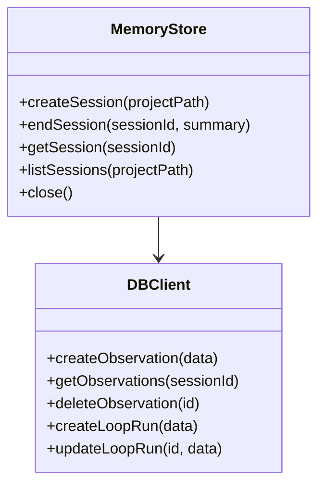
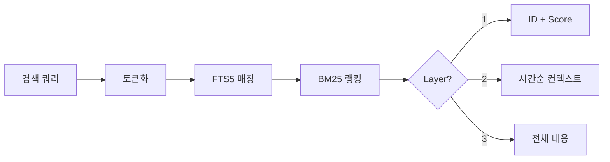
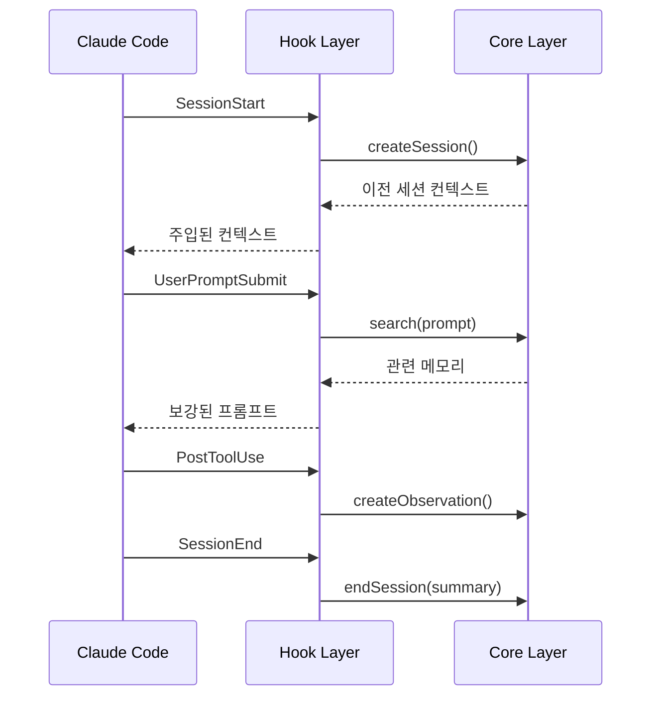
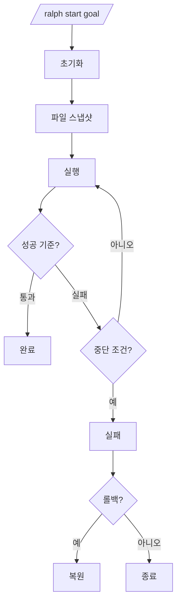
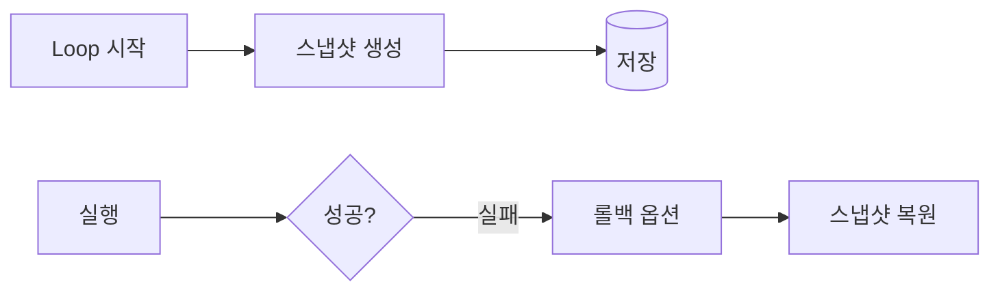
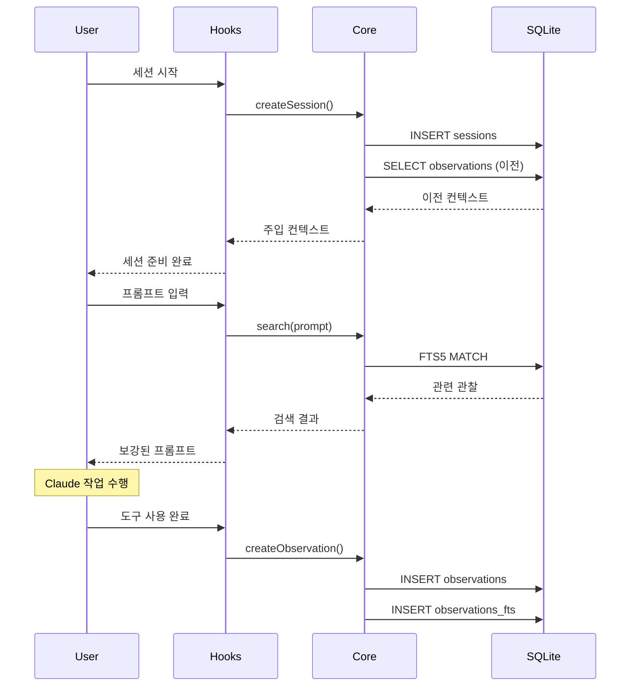
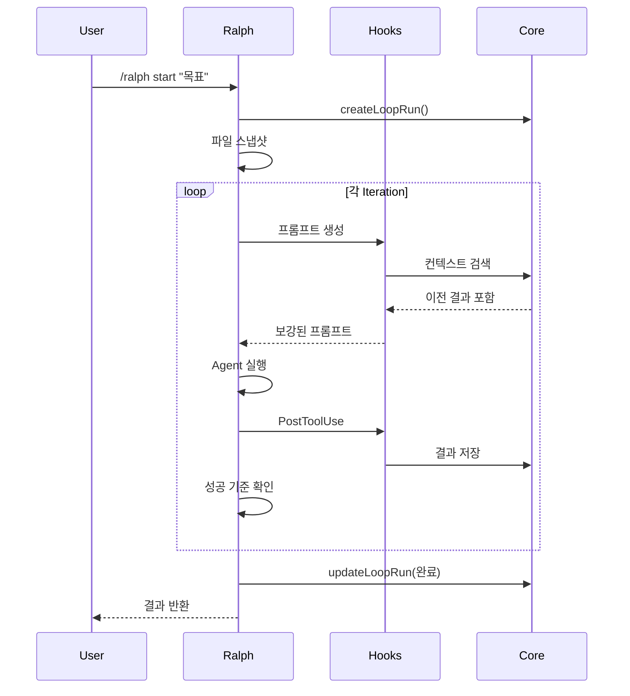
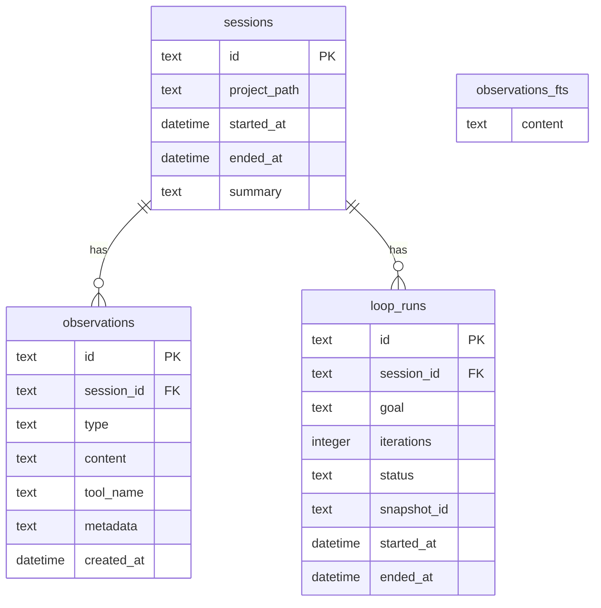
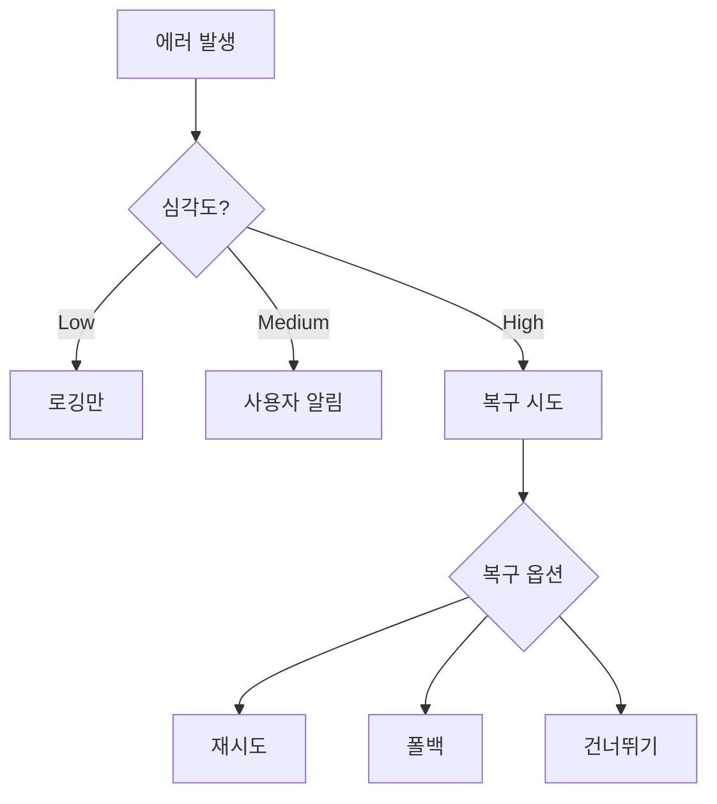

# ralph-mem 아키텍처

> Claude Code를 위한 지속적 컨텍스트 관리 플러그인

## 개요

ralph-mem은 세 가지 레이어로 구성된 플러그인입니다:

1. **Core Layer**: 메모리 저장/검색 인프라
2. **Hook Layer**: 자동 컨텍스트 주입/기록
3. **Feature Layer**: Ralph Loop 반복 실행 엔진

```mermaid
flowchart TB
    subgraph Feature["Feature Layer"]
        direction LR
        Loop[Ralph Loop Engine]
        Criteria[Success Criteria]
        Snapshot[File Snapshot]
    end

    subgraph Hook["Hook Layer"]
        direction LR
        Start[SessionStart]
        Submit[UserPromptSubmit]
        Tool[PostToolUse]
        End[SessionEnd]
    end

    subgraph Core["Core Layer"]
        direction LR
        Store[Memory Store]
        Search[Search Engine]
        Compress[Compressor]
        Embed[Embedding Service]
    end

    subgraph Skills["Skills"]
        direction LR
        Ralph[/ralph]
        MemSearch[/mem-search]
        MemStatus[/mem-status]
        MemInject[/mem-inject]
        MemForget[/mem-forget]
    end

    Feature --> Core
    Hook --> Core
    Skills --> Core
    Skills --> Feature
    Core --> DB[(SQLite + FTS5)]
```

## 디렉토리 구조

```text
src/
├── index.ts                    # 플러그인 진입점
├── core/                       # Core Layer
│   ├── store.ts               # Memory Store (세션/관찰 CRUD)
│   ├── search.ts              # Search Engine (FTS5)
│   ├── compressor.ts          # Context Compressor
│   ├── embedding.ts           # Embedding Service
│   └── db/
│       ├── client.ts          # DB 클라이언트
│       ├── schema.ts          # 스키마 정의
│       ├── paths.ts           # 경로 유틸리티
│       ├── types.ts           # 타입 정의
│       └── migrations/        # 마이그레이션
├── hooks/                      # Hook Layer
│   ├── session-start.ts       # 세션 시작 hook
│   ├── session-end.ts         # 세션 종료 hook
│   ├── post-tool-use.ts       # 도구 사용 후 hook
│   └── user-prompt-submit.ts  # 프롬프트 제출 hook
├── features/ralph/             # Feature Layer
│   ├── engine.ts              # Loop 엔진
│   ├── criteria.ts            # 성공 기준 평가
│   ├── stop-conditions.ts     # 중단 조건
│   └── snapshot.ts            # 파일 스냅샷/롤백
├── skills/                     # Slash Commands
│   ├── ralph.ts               # /ralph start|stop|status
│   ├── ralph-config.ts        # /ralph config
│   ├── mem-search.ts          # /mem-search
│   ├── mem-status.ts          # /mem-status
│   ├── mem-inject.ts          # /mem-inject
│   └── mem-forget.ts          # /mem-forget
└── utils/
    ├── config.ts              # 설정 시스템
    ├── tokens.ts              # 토큰 계산
    └── errors.ts              # 에러 핸들링
```

## Core Layer

### Memory Store

세션과 관찰(observation)의 생명주기를 관리합니다.



**주요 타입:**

```typescript
interface Session {
  id: string;           // "sess-xxx"
  project_path: string;
  started_at: Date;
  ended_at?: Date;
  summary?: string;
}

interface Observation {
  id: string;           // "obs-xxx"
  session_id: string;
  type: "tool_use" | "error" | "success" | "note";
  content: string;
  tool_name?: string;
  created_at: Date;
}
```

### Search Engine

FTS5 기반 전문 검색을 제공합니다.



**Progressive Disclosure:**

| Layer | 토큰 | 내용 |
|-------|------|------|
| 1 | 50-100 | ID, 점수, 요약 |
| 2 | 200-300 | 시간순 컨텍스트 |
| 3 | 500-1000 | 전체 내용 + 코드 |

### Compressor

컨텍스트 압축 및 요약을 수행합니다.

```typescript
interface CompressorConfig {
  maxTokens: number;      // 최대 토큰 수
  preserveTypes: string[]; // 유지할 타입 (error, success)
}

function compressContext(observations: Observation[], config: CompressorConfig): string;
```

### Embedding Service

의미 기반 검색을 위한 벡터 임베딩을 제공합니다.

```typescript
interface EmbeddingService {
  embed(text: string): Promise<number[]>;
  similarity(a: number[], b: number[]): number;
}
```

## Hook Layer

Claude Code 이벤트에 자동으로 반응합니다.



### Hook 상세

| Hook | 트리거 | 동작 |
|------|--------|------|
| SessionStart | 세션 시작 | 세션 생성, 이전 컨텍스트 주입 |
| UserPromptSubmit | 프롬프트 제출 전 | 관련 메모리 검색 및 주입 |
| PostToolUse | 도구 사용 후 | 결과를 관찰로 기록 |
| SessionEnd | 세션 종료 | 요약 생성 및 저장 |

## Feature Layer (Ralph Loop)

목표 달성까지 반복 실행합니다.



### 성공 기준 (Success Criteria)

```typescript
type CriteriaType =
  | "test_pass"      // 테스트 통과
  | "build_success"  // 빌드 성공
  | "lint_clean"     // Lint 오류 없음
  | "type_check"     // 타입 체크 통과
  | "custom"         // 사용자 정의
  | "marker";        // 출력 마커

interface SuccessCriteria {
  type: CriteriaType;
  command?: string;
  expected?: string | number;
}
```

### 중단 조건 (Stop Conditions)

```typescript
interface StopConditions {
  maxIterations: number;       // 최대 반복 횟수 (기본: 10)
  maxDuration: number;         // 최대 실행 시간 (ms)
  noProgressThreshold: number; // 진척 없음 임계값
}
```

### 파일 스냅샷



## Skills (Slash Commands)

| 명령어 | 설명 |
|--------|------|
| `/ralph start <goal>` | Loop 시작 |
| `/ralph stop [--rollback]` | Loop 중단 |
| `/ralph status` | 상태 조회 |
| `/ralph config [key] [value]` | 설정 조회/변경 |
| `/mem-search <query> [--layer N]` | 메모리 검색 |
| `/mem-status` | 메모리 사용량 조회 |
| `/mem-inject <content>` | 수동 메모리 주입 |
| `/mem-forget <id> [--confirm]` | 메모리 삭제 |

## 데이터 흐름

### 일반 세션



### Ralph Loop



## 저장소 구조

```text
~/.config/ralph-mem/           # 글로벌 설정
├── config.yaml               # 글로벌 설정
└── memory.db                 # 글로벌 메모리 DB

<project>/.ralph-mem/          # 프로젝트별
├── config.yaml               # 프로젝트 설정 (오버라이드)
└── memory.db                 # 프로젝트 메모리 DB
```

### DB 스키마



## 설정 시스템

```yaml
# config.yaml
memory:
  max_observations: 1000
  retention_days: 30
  auto_compress: true

search:
  default_layer: 2
  max_results: 10

ralph:
  max_iterations: 10
  cooldown_ms: 1000
  auto_rollback: false
  success_criteria:
    - type: test_pass
    - type: build_success
```

**우선순위**: 프로젝트 설정 > 글로벌 설정 > 기본값

## 에러 핸들링



| 심각도 | 예시 | 처리 |
|--------|------|------|
| Low | 캐시 미스 | 로깅 후 계속 |
| Medium | DB 쿼리 실패 | 사용자 알림, 폴백 |
| High | DB 손상 | 복구 옵션 제시 |

## 성능 지표

| 지표 | 목표 | 실측 |
|------|------|------|
| 검색 응답 (1000 obs) | < 200ms | ~0.6ms |
| Hook 오버헤드 | < 50ms | ~9ms |
| 세션 시작 | < 500ms | ~1ms |
| DB 크기 (1000 세션) | < 100MB | ~60MB |

## 기술 스택

| 분류 | 기술 | 이유 |
|------|------|------|
| Runtime | Bun | 빠른 시작, SQLite 내장 |
| Language | TypeScript | 타입 안정성 |
| Database | SQLite + FTS5 | 로컬, 전문 검색 |
| Testing | Vitest | Bun 호환, 빠른 실행 |

## 관련 문서

- [PRD](PRD.md) - 요구사항 정의서
- [설계 문서](design/README.md) - 상세 설계
- [이슈 목록](issues/README.md) - 구현 태스크
