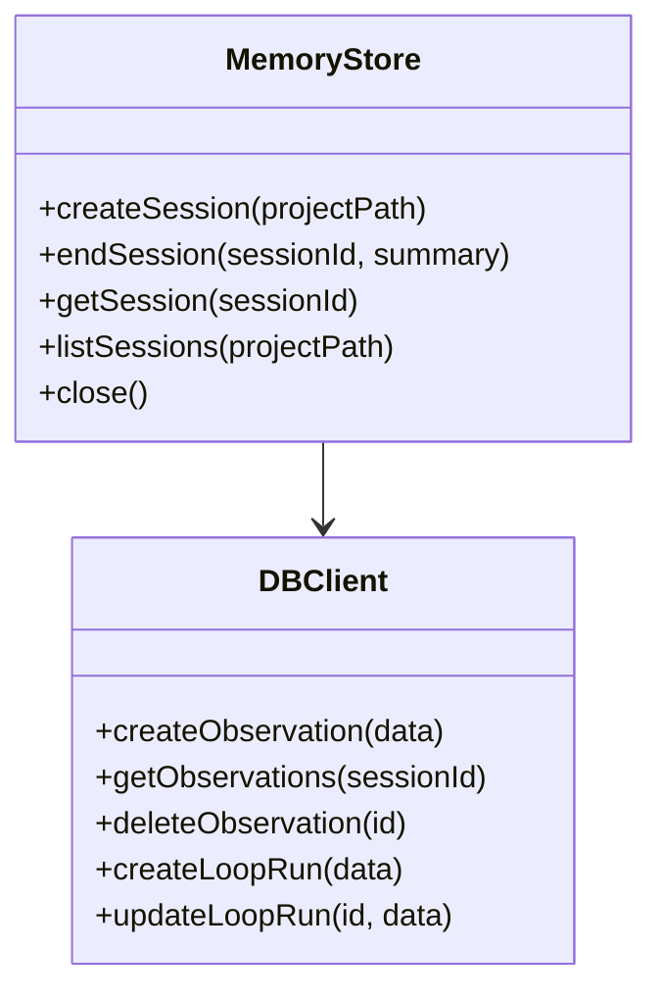
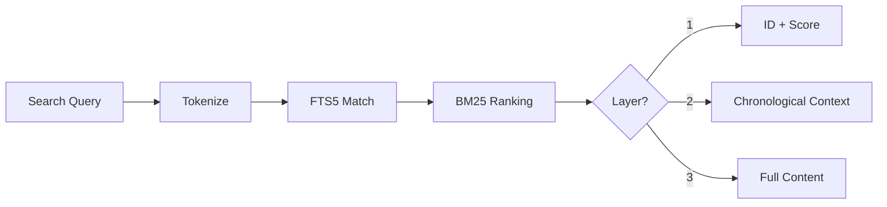
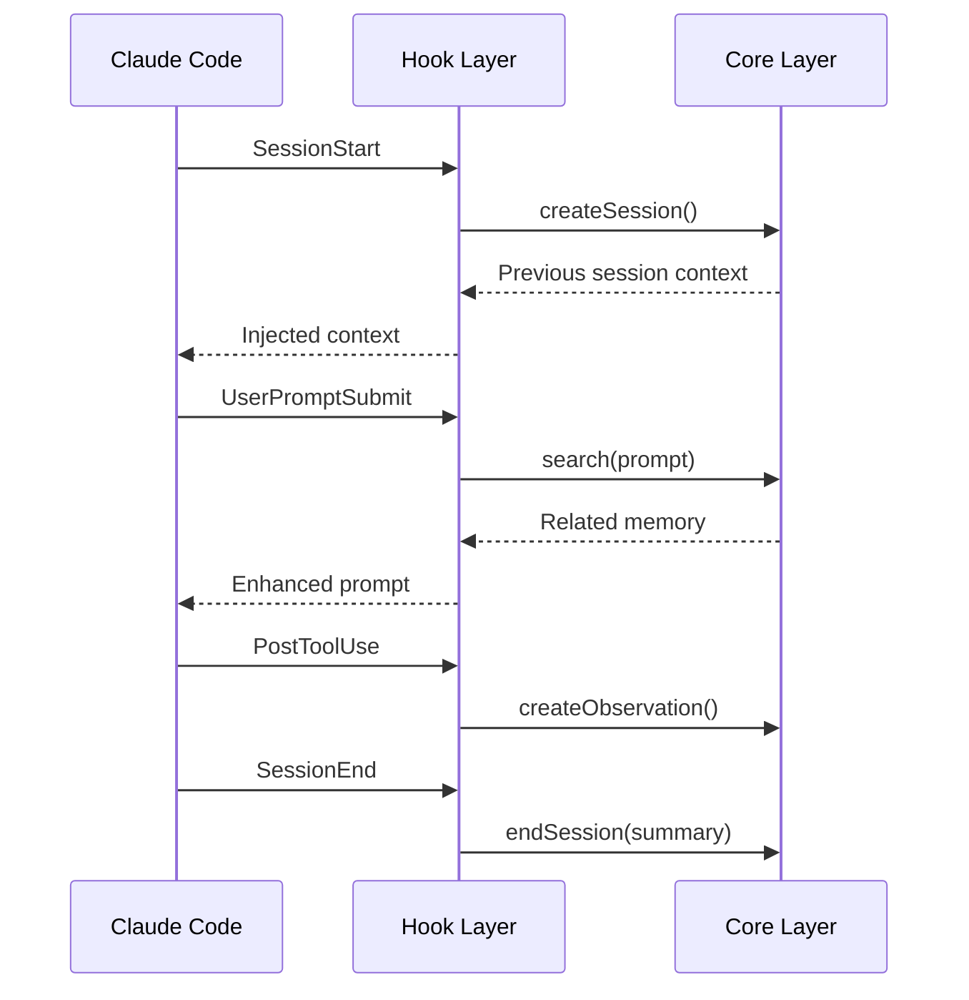
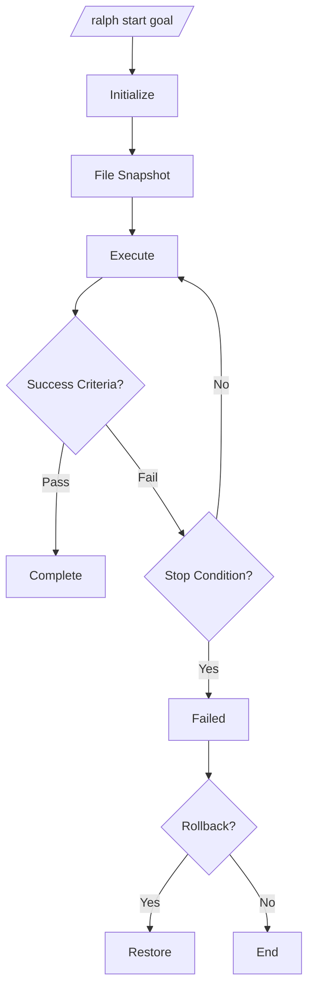
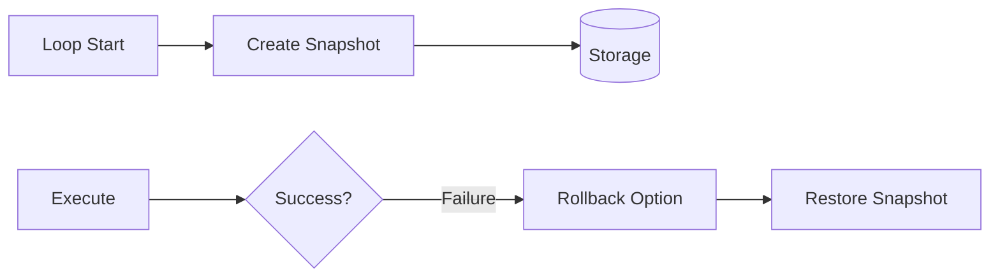
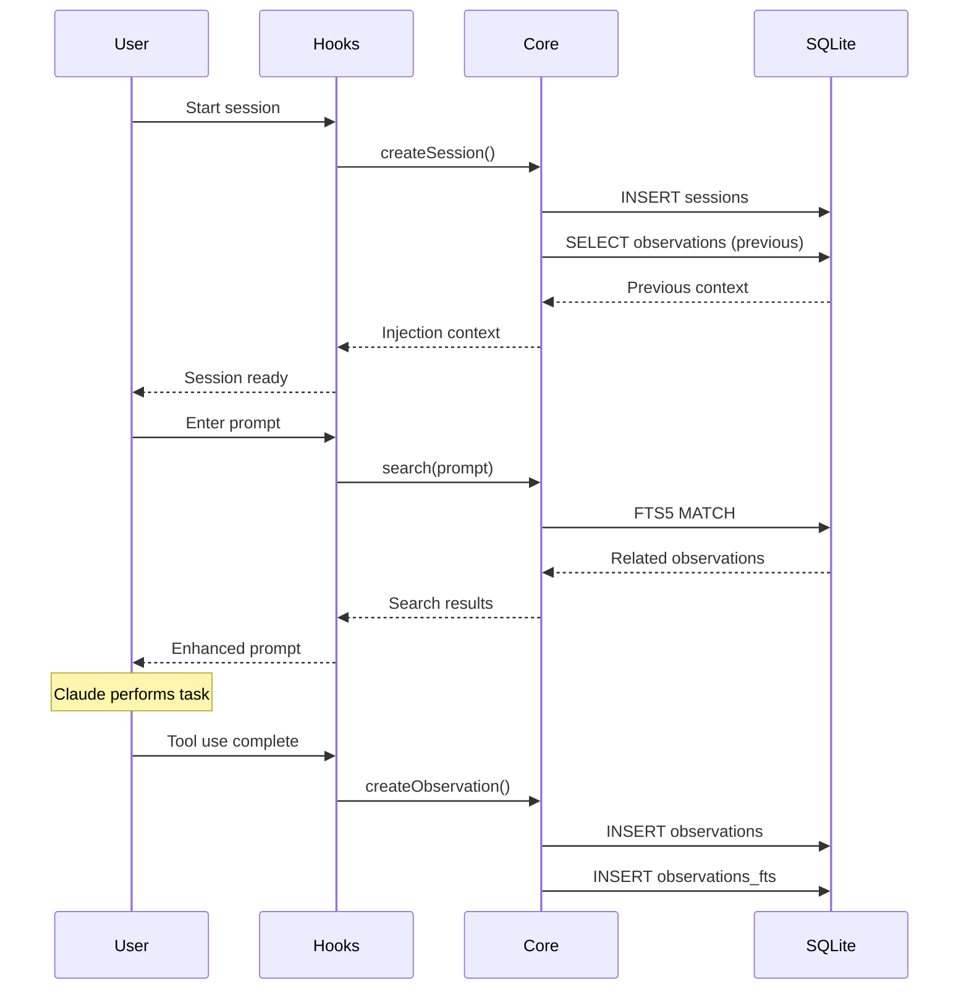
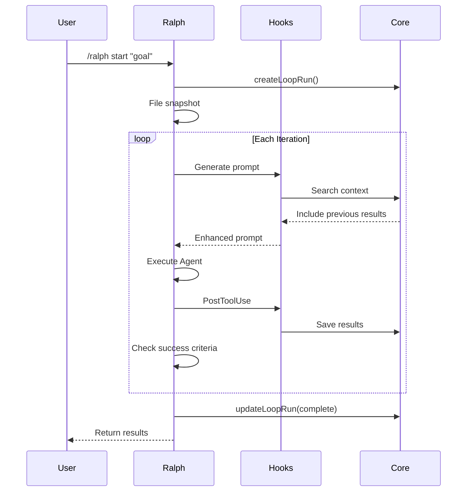
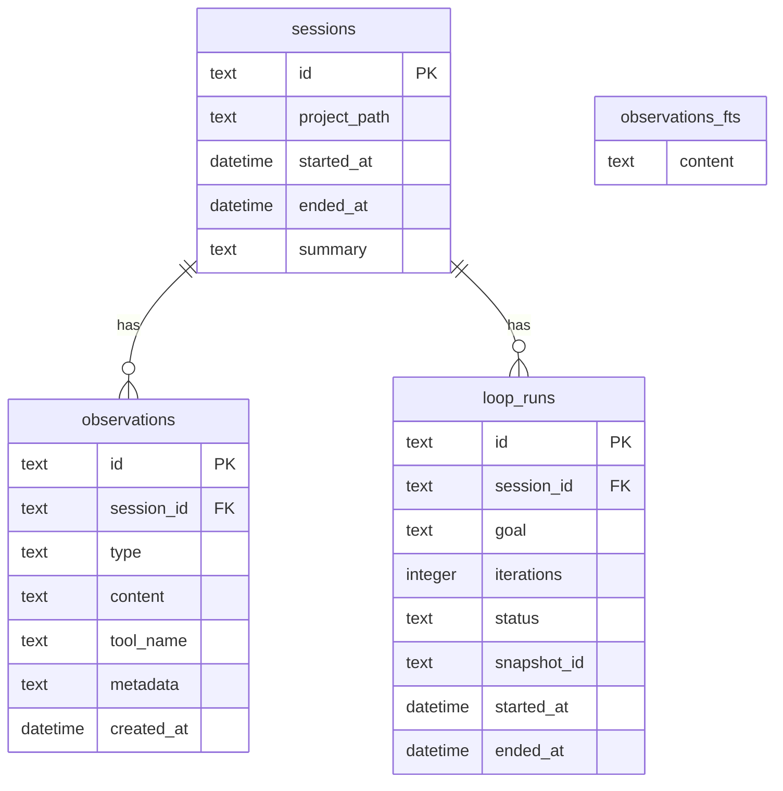
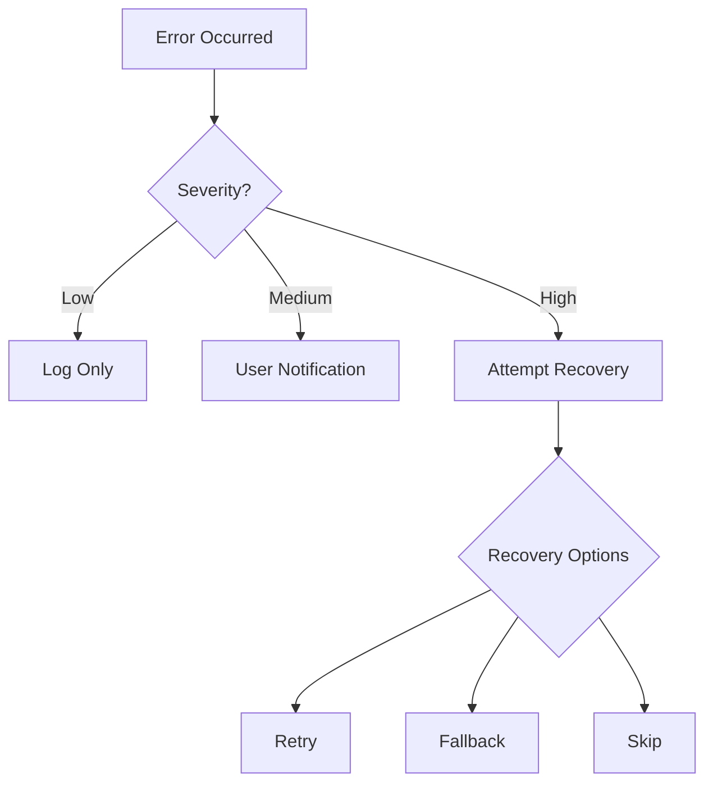

# ralph-mem Architecture

> A persistent context management plugin for Claude Code

**[한국어 버전 (Korean)](./ARCHITECTURE.ko.md)**

## Overview

ralph-mem is a plugin composed of three layers:

1. **Core Layer**: Memory storage/retrieval infrastructure
2. **Hook Layer**: Automatic context injection/recording
3. **Feature Layer**: Ralph Loop iterative execution engine

```mermaid
flowchart TB
    subgraph Feature["Feature Layer"]
        direction LR
        Loop[Ralph Loop Engine]
        Criteria[Success Criteria]
        Snapshot[File Snapshot]
    end

    subgraph Hook["Hook Layer"]
        direction LR
        Start[SessionStart]
        Submit[UserPromptSubmit]
        Tool[PostToolUse]
        End[SessionEnd]
    end

    subgraph Core["Core Layer"]
        direction LR
        Store[Memory Store]
        Search[Search Engine]
        Compress[Compressor]
        Embed[Embedding Service]
    end

    subgraph Skills["Skills"]
        direction LR
        Ralph[/ralph]
        MemSearch[/mem-search]
        MemStatus[/mem-status]
        MemInject[/mem-inject]
        MemForget[/mem-forget]
    end

    Feature --> Core
    Hook --> Core
    Skills --> Core
    Skills --> Feature
    Core --> DB[(SQLite + FTS5)]
```

## Directory Structure

```text
src/
├── index.ts                    # Plugin entry point
├── core/                       # Core Layer
│   ├── store.ts               # Memory Store (session/observation CRUD)
│   ├── search.ts              # Search Engine (FTS5)
│   ├── compressor.ts          # Context Compressor
│   ├── embedding.ts           # Embedding Service
│   └── db/
│       ├── client.ts          # DB client
│       ├── schema.ts          # Schema definition
│       ├── paths.ts           # Path utilities
│       ├── types.ts           # Type definitions
│       └── migrations/        # Migrations
├── hooks/                      # Hook Layer
│   ├── session-start.ts       # Session start hook
│   ├── session-end.ts         # Session end hook
│   ├── post-tool-use.ts       # Post tool use hook
│   └── user-prompt-submit.ts  # Prompt submit hook
├── features/ralph/             # Feature Layer
│   ├── engine.ts              # Loop engine
│   ├── criteria.ts            # Success criteria evaluation
│   ├── stop-conditions.ts     # Stop conditions
│   └── snapshot.ts            # File snapshot/rollback
├── skills/                     # Slash Commands
│   ├── ralph.ts               # /ralph start|stop|status
│   ├── ralph-config.ts        # /ralph config
│   ├── mem-search.ts          # /mem-search
│   ├── mem-status.ts          # /mem-status
│   ├── mem-inject.ts          # /mem-inject
│   └── mem-forget.ts          # /mem-forget
└── utils/
    ├── config.ts              # Config system
    ├── tokens.ts              # Token calculation
    └── errors.ts              # Error handling
```

## Core Layer

### Memory Store

Manages the lifecycle of sessions and observations.



**Key Types:**

```typescript
interface Session {
  id: string;           // "sess-xxx"
  project_path: string;
  started_at: Date;
  ended_at?: Date;
  summary?: string;
}

interface Observation {
  id: string;           // "obs-xxx"
  session_id: string;
  type: "tool_use" | "error" | "success" | "note";
  content: string;
  tool_name?: string;
  created_at: Date;
}
```

### Search Engine

Provides FTS5-based full-text search.



**Progressive Disclosure:**

| Layer | Tokens | Content |
|-------|--------|---------|
| 1 | 50-100 | ID, score, summary |
| 2 | 200-300 | Chronological context |
| 3 | 500-1000 | Full content + code |

### Compressor

Performs context compression and summarization.

```typescript
interface CompressorConfig {
  maxTokens: number;      // Maximum tokens
  preserveTypes: string[]; // Types to preserve (error, success)
}

function compressContext(observations: Observation[], config: CompressorConfig): string;
```

### Embedding Service

Provides vector embeddings for semantic search.

```typescript
interface EmbeddingService {
  embed(text: string): Promise<number[]>;
  similarity(a: number[], b: number[]): number;
}
```

## Hook Layer

Automatically responds to Claude Code events.



### Hook Details

| Hook | Trigger | Action |
|------|---------|--------|
| SessionStart | Session start | Create session, inject previous context |
| UserPromptSubmit | Before prompt submission | Search and inject related memory |
| PostToolUse | After tool use | Record result as observation |
| SessionEnd | Session end | Generate and save summary |

## Feature Layer (Ralph Loop)

Iteratively executes until goal is achieved.



### Success Criteria

```typescript
type CriteriaType =
  | "test_pass"      // Tests pass
  | "build_success"  // Build succeeds
  | "lint_clean"     // No lint errors
  | "type_check"     // Type check passes
  | "custom"         // User-defined
  | "marker";        // Output marker

interface SuccessCriteria {
  type: CriteriaType;
  command?: string;
  expected?: string | number;
}
```

### Stop Conditions

```typescript
interface StopConditions {
  maxIterations: number;       // Maximum iterations (default: 10)
  maxDuration: number;         // Maximum execution time (ms)
  noProgressThreshold: number; // No-progress threshold
}
```

### File Snapshot



## Skills (Slash Commands)

| Command | Description |
|---------|-------------|
| `/ralph start <goal>` | Start Loop |
| `/ralph stop [--rollback]` | Stop Loop |
| `/ralph status` | Check status |
| `/ralph config [key] [value]` | View/modify config |
| `/mem-search <query> [--layer N]` | Search memory |
| `/mem-status` | Check memory usage |
| `/mem-inject <content>` | Manual memory injection |
| `/mem-forget <id> [--confirm]` | Delete memory |

## Data Flow

### Normal Session



### Ralph Loop



## Storage Structure

```text
~/.config/ralph-mem/           # Global config
├── config.yaml               # Global settings
└── memory.db                 # Global memory DB

<project>/.ralph-mem/          # Per-project
├── config.yaml               # Project settings (override)
└── memory.db                 # Project memory DB
```

### DB Schema



## Config System

```yaml
# config.yaml
memory:
  max_observations: 1000
  retention_days: 30
  auto_compress: true

search:
  default_layer: 2
  max_results: 10

ralph:
  max_iterations: 10
  cooldown_ms: 1000
  auto_rollback: false
  success_criteria:
    - type: test_pass
    - type: build_success
```

**Priority**: Project settings > Global settings > Defaults

## Error Handling



| Severity | Example | Handling |
|----------|---------|----------|
| Low | Cache miss | Log and continue |
| Medium | DB query failure | Notify user, fallback |
| High | DB corruption | Present recovery options |

## Performance Metrics

| Metric | Target | Actual |
|--------|--------|--------|
| Search response (1000 obs) | < 200ms | ~0.6ms |
| Hook overhead | < 50ms | ~9ms |
| Session start | < 500ms | ~1ms |
| DB size (1000 sessions) | < 100MB | ~60MB |

## Tech Stack

| Category | Technology | Reason |
|----------|------------|--------|
| Runtime | Bun | Fast startup, built-in SQLite |
| Language | TypeScript | Type safety |
| Database | SQLite + FTS5 | Local, full-text search |
| Testing | Bun Test | Bun compatible, fast execution |

## Related Documents

- [PRD](PRD.md) - Product Requirements Document
- [Design Docs](design/README.md) - Detailed Design
- [Issues](issues/README.md) - Implementation Tasks
