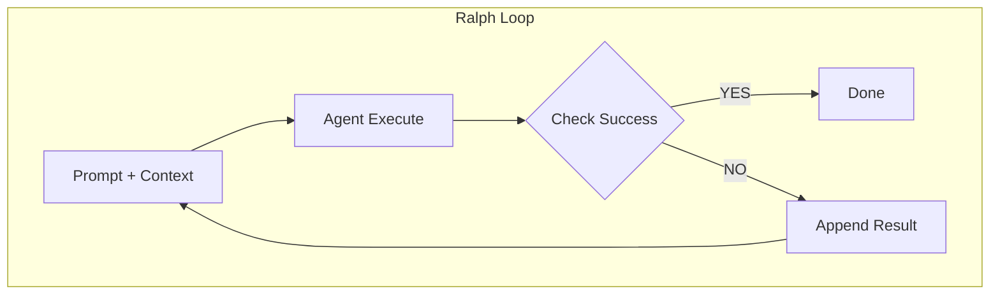
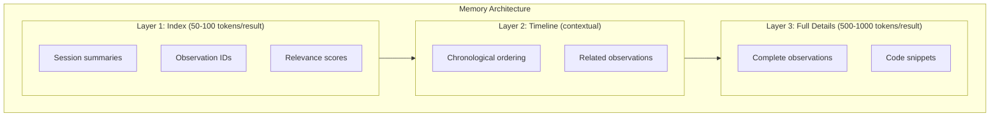
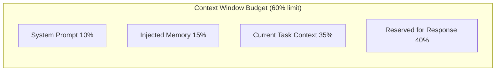
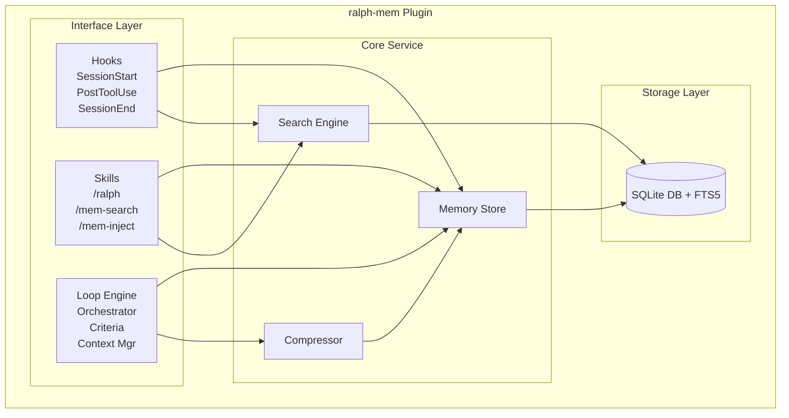
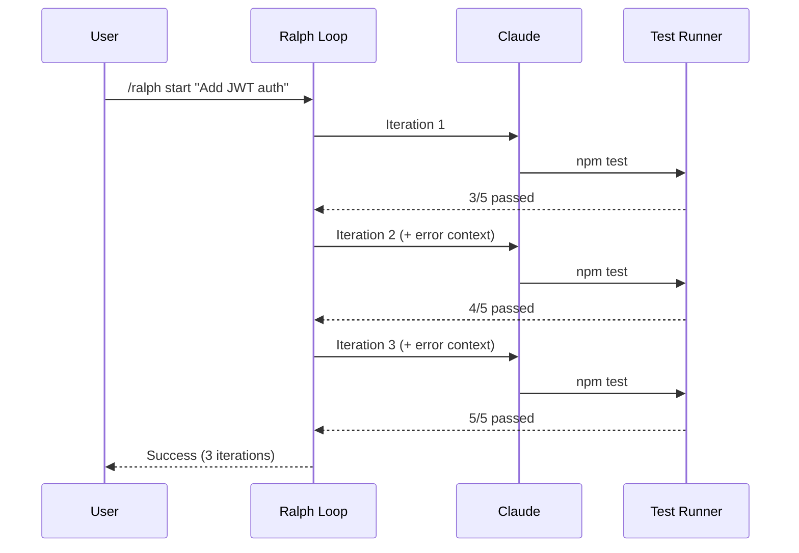
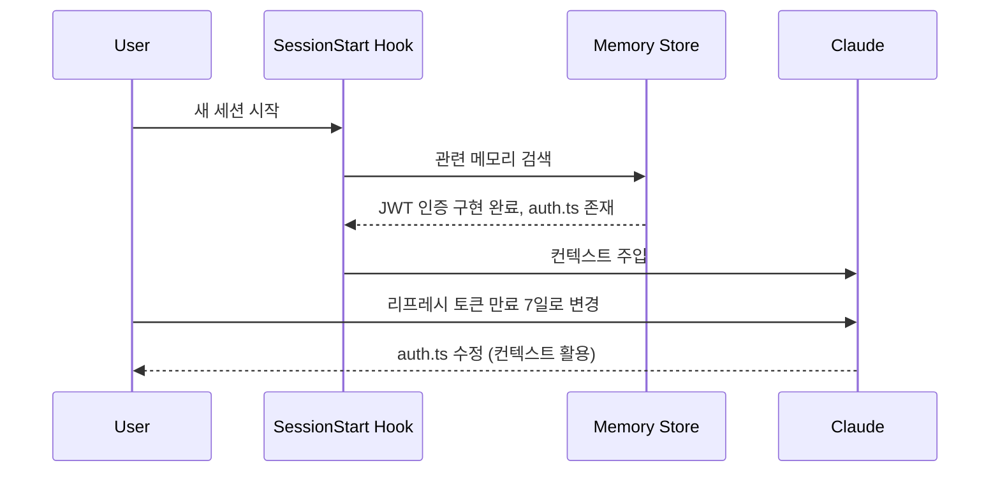

# ralph-mem PRD (Product Requirements Document)

## 1. 개요

### 1.1 제품명

**ralph-mem** - Claude Code를 위한 Ralph Loop 기반 지속적 컨텍스트 관리 플러그인

### 1.2 문제 정의

LLM 기반 코딩 에이전트는 다음과 같은 핵심 한계를 가진다:

| 문제              | 설명                                                         |
| ----------------- | ------------------------------------------------------------ |
| **Context Rot**   | 누적된 불필요한 정보로 인한 모델 성능 저하                   |
| **Compaction**    | context window의 60-70% 초과 시 출력 품질 급락 ("dumb zone") |
| **Forgetfulness** | 세션 간 작업 맥락 손실                                       |
| **One-shot 실패** | 복잡한 작업에서 단일 시도로는 성공률 저조                    |

### 1.3 솔루션

Ralph Loop의 "끈질긴 반복" 철학과 claude-mem의 "지능적 컨텍스트 관리"를 결합하여:

1. **결정론적 컨텍스트 할당**: context window를 명시적으로 관리
2. **성공 기준 기반 반복**: 테스트 통과/목표 달성까지 자동 재시도
3. **지속적 메모리**: 세션 간 관련 컨텍스트 자동 주입
4. **Progressive Disclosure**: 토큰 효율적인 3계층 검색

---

## 2. 목표 및 비목표

### 2.1 목표

1. Claude Code 플러그인으로 즉시 사용 가능한 Ralph Loop 구현
2. 세션 간 지속적 메모리를 통한 컨텍스트 연속성 보장
3. Context rot 및 compaction 문제 자동 완화
4. 성공 기준 기반 자동 반복 실행 지원

### 2.2 비목표

1. Claude Code 외 다른 AI 에이전트 지원 (v1 범위 외)
2. 멀티 에이전트 오케스트레이션 ("Gas Town") (v2 이후)
3. 클라우드 기반 메모리 동기화 (로컬 전용)

---

## 3. 핵심 개념

### 3.1 Ralph Loop 원리



**핵심 원칙:**

- 단일 목표 집중 (Single Goal Focus)
- 결정론적 컨텍스트 관리 (Deterministic Context Allocation)
- 성공 기준 명시 (Explicit Success Criteria)
- 과열 방지 (Overbaking Prevention)

### 3.2 메모리 계층 구조



---

## 4. 기능 요구사항

### 4.1 Ralph Loop Engine

#### 4.1.1 Loop Configuration

```yaml
ralph:
  max_iterations: 10          # 최대 반복 횟수
  success_criteria:
    - type: test_pass         # 테스트 통과
    - type: build_success     # 빌드 성공
    - type: custom            # 사용자 정의 조건
      command: "npm run lint"
      expected_exit_code: 0
  context_budget: 0.6         # context window 사용률 상한 (60%)
  cooldown_ms: 1000           # 반복 간 대기 시간
```

#### 4.1.2 Loop Commands

| Command               | 설명                       |
| --------------------- | -------------------------- |
| `/ralph start <goal>` | 목표와 함께 Ralph Loop 시작 |
| `/ralph stop`         | 현재 Loop 중단             |
| `/ralph status`       | Loop 상태 및 진행률 확인   |
| `/ralph config`       | Loop 설정 조회/변경        |

#### 4.1.3 Success Criteria Types

| Type            | 설명             | 예시                 |
| --------------- | ---------------- | -------------------- |
| `test_pass`     | 테스트 명령 성공 | `npm test`, `pytest` |
| `build_success` | 빌드 명령 성공   | `npm run build`      |
| `lint_clean`    | Lint 오류 없음   | `eslint`, `ruff`     |
| `type_check`    | 타입 체크 통과   | `tsc --noEmit`       |
| `custom`        | 사용자 정의 명령 | 임의 shell command   |
| `marker`        | 특정 출력 마커   | `[RALPH_SUCCESS]`    |

### 4.2 Persistent Memory

#### 4.2.1 Lifecycle Hooks

| Hook               | 시점           | 용도             |
| ------------------ | -------------- | ---------------- |
| `SessionStart`     | 세션 시작      | 관련 메모리 주입 |
| `UserPromptSubmit` | 프롬프트 제출 전 | 컨텍스트 보강    |
| `PostToolUse`      | 도구 사용 후   | 관찰 기록        |
| `LoopIteration`    | Loop 반복 시   | 결과 누적        |
| `SessionEnd`       | 세션 종료      | 요약 생성 및 저장 |

#### 4.2.2 Storage Schema

```sql
-- 세션 테이블
CREATE TABLE sessions (
    id TEXT PRIMARY KEY,
    project_path TEXT NOT NULL,
    started_at DATETIME DEFAULT CURRENT_TIMESTAMP,
    ended_at DATETIME,
    summary TEXT,
    tags TEXT  -- JSON array
);

-- 관찰 테이블
CREATE TABLE observations (
    id TEXT PRIMARY KEY,
    session_id TEXT REFERENCES sessions(id),
    type TEXT NOT NULL,  -- 'tool_use', 'error', 'success', 'note'
    content TEXT NOT NULL,
    metadata TEXT,  -- JSON
    created_at DATETIME DEFAULT CURRENT_TIMESTAMP
);

-- Loop 실행 테이블
CREATE TABLE loop_runs (
    id TEXT PRIMARY KEY,
    session_id TEXT REFERENCES sessions(id),
    goal TEXT NOT NULL,
    iterations INTEGER DEFAULT 0,
    status TEXT NOT NULL,  -- 'running', 'success', 'failed', 'stopped'
    context_snapshots TEXT,  -- JSON array
    started_at DATETIME DEFAULT CURRENT_TIMESTAMP,
    ended_at DATETIME
);

-- FTS5 전문 검색
CREATE VIRTUAL TABLE observations_fts USING fts5(
    content,
    content=observations,
    content_rowid=rowid
);
```

#### 4.2.3 Memory Search API

```typescript
interface MemorySearchOptions {
  query: string;
  project?: string;
  timeRange?: { start: Date; end: Date };
  types?: ObservationType[];
  limit?: number;
  layer?: 1 | 2 | 3;  // Progressive disclosure
}

interface SearchResult {
  layer1: IndexResult[];      // Compact (IDs + scores)
  layer2?: TimelineResult[];  // Contextual
  layer3?: FullResult[];      // Complete details
  tokenEstimate: number;
}
```

### 4.3 Context Management

#### 4.3.1 Context Budget Enforcement



| 영역                 | 비율 |
| -------------------- | ---- |
| System Prompt        | 10%  |
| Injected Memory      | 15%  |
| Current Task Context | 35%  |
| Reserved for Response | 40%  |

#### 4.3.2 Context Trimming Strategy

| 전략            | 적용 시점   | 방법                   |
| --------------- | ----------- | ---------------------- |
| **Recency**     | 기본        | 오래된 컨텍스트부터 제거 |
| **Relevance**   | 검색 시     | 관련성 낮은 항목 제외  |
| **Compression** | 임계치 도달 | AI 요약으로 압축       |
| **Selective**   | Loop 중     | 성공/실패 핵심만 유지  |

### 4.4 Skills (Slash Commands)

| Skill         | 설명                               |
| ------------- | ---------------------------------- |
| `/ralph`      | Ralph Loop 제어                    |
| `/mem-search` | 메모리 검색 (Progressive Disclosure) |
| `/mem-inject` | 수동 컨텍스트 주입                 |
| `/mem-forget` | 특정 메모리 제거                   |
| `/mem-status` | 메모리 사용량 및 상태              |

---

## 5. 비기능 요구사항

### 5.1 성능

| 지표                       | 목표    |
| -------------------------- | ------- |
| 메모리 검색 응답 시간      | < 200ms |
| Hook 실행 오버헤드         | < 50ms  |
| 세션 시작 시 메모리 주입   | < 500ms |
| SQLite DB 크기 (1000 세션) | < 100MB |

### 5.2 안정성

- Loop 중 비정상 종료 시 상태 자동 복구
- DB 손상 시 자동 백업 복원
- Hook 실패 시 세션 계속 진행 (graceful degradation)

### 5.3 보안

- `<private>` 태그로 민감 정보 저장 제외
- 로컬 전용 저장 (네트워크 전송 없음)
- DB 파일 접근 권한 제한 (600)

---

## 6. 기술 아키텍처

### 6.1 컴포넌트 다이어그램



### 6.2 파일 구조

```text
ralph-mem/
├── plugin.json              # Claude Code 플러그인 매니페스트
├── package.json
├── tsconfig.json
├── src/
│   ├── index.ts             # 플러그인 진입점
│   ├── hooks/
│   │   ├── session-start.ts
│   │   ├── post-tool-use.ts
│   │   ├── session-end.ts
│   │   └── user-prompt-submit.ts
│   ├── skills/
│   │   ├── ralph.ts         # /ralph 명령
│   │   ├── mem-search.ts    # /mem-search 명령
│   │   └── mem-inject.ts    # /mem-inject 명령
│   ├── loop/
│   │   ├── engine.ts        # Loop 실행 엔진
│   │   ├── criteria.ts      # 성공 기준 평가
│   │   └── context-manager.ts
│   ├── memory/
│   │   ├── store.ts         # 메모리 저장소
│   │   ├── search.ts        # 검색 엔진
│   │   └── compressor.ts    # 컨텍스트 압축
│   ├── db/
│   │   ├── schema.ts        # DB 스키마
│   │   ├── migrations/
│   │   └── client.ts        # SQLite 클라이언트
│   └── utils/
│       ├── tokens.ts        # 토큰 계산
│       └── config.ts        # 설정 관리
├── prompts/
│   └── compressor.md        # 압축용 프롬프트
├── docs/
│   ├── PRD.md
│   └── ARCHITECTURE.md
└── tests/
    ├── loop.test.ts
    ├── memory.test.ts
    └── hooks.test.ts
```

### 6.3 기술 스택

| 분류     | 기술           | 이유                     |
| -------- | -------------- | ------------------------ |
| Runtime  | Bun            | 빠른 시작 시간, SQLite 내장 |
| Language | TypeScript     | 타입 안정성              |
| Database | SQLite + FTS5  | 로컬 전용, 전문 검색     |
| Testing  | Vitest         | Bun 호환, 빠른 실행      |

---

## 7. 사용자 시나리오

### 7.1 시나리오 1: 테스트 통과까지 자동 반복



### 7.2 시나리오 2: 이전 세션 컨텍스트 활용



### 7.3 시나리오 3: 메모리 검색

```text
사용자: /mem-search "authentication error handling"

[Layer 1 결과 - 50 tokens]
Found 5 relevant observations:
1. [obs-a1b2] Session 2024-01-15: JWT error handling
2. [obs-c3d4] Session 2024-01-14: Auth middleware errors
3. [obs-e5f6] Session 2024-01-10: Login validation
...

사용자: /mem-search --layer 3 obs-a1b2

[Layer 3 결과 - 800 tokens]
Full observation:
- Session: 2024-01-15 (JWT 인증 구현)
- Type: tool_use
- Content:
  auth.ts에 다음 에러 핸들링 추가:
  - TokenExpiredError → 401 + refresh 안내
  - InvalidTokenError → 401 + 재로그인 요청
  ...
```

---

## 8. 태스크 리스트

> 상세 태스크는 [TASKS.md](../TASKS.md)에서 관리합니다.

| Phase              | 태스크 수 | 주요 내용                              |
| ------------------ | --------- | -------------------------------------- |
| Phase 1: Foundation | 8         | 프로젝트 구조, DB, 기본 Hooks          |
| Phase 2: Ralph Loop | 9         | Loop Engine, Success Criteria, Skills  |
| Phase 3: Intelligence | 8       | AI 압축, 검색 최적화, Progressive Disclosure |
| Phase 4: Polish    | 12        | 테스트, 추가 Skills, 문서화            |

---

## 9. 성공 지표

| 지표           | 목표   | 측정 방법                      |
| -------------- | ------ | ------------------------------ |
| Loop 성공률    | > 70%  | 성공/전체 Loop 비율            |
| 평균 반복 횟수 | < 5회  | 성공 Loop의 평균 iteration     |
| 메모리 활용률  | > 50%  | 주입된 컨텍스트 실제 참조율    |
| 사용자 만족도  | > 4/5  | 피드백 설문                    |

---

## 10. 참고 자료

- [Ralph Loop - Geoffrey Huntley](https://ghuntley.com/ralph/)
- [claude-mem - thedotmack](https://github.com/thedotmack/claude-mem)
- [Claude Code Hooks Documentation](https://docs.anthropic.com/claude-code/hooks)
- [The Brief History of Ralph](https://www.humanlayer.dev/blog/brief-history-of-ralph)

---

## 11. 변경 이력

| 버전 | 날짜       | 작성자 | 변경 내용                                  |
| ---- | ---------- | ------ | ------------------------------------------ |
| 0.1  | 2025-01-17 | -      | 초안 작성                                  |
| 0.2  | 2025-01-17 | -      | 다이어그램 Mermaid 변환, 마일스톤→태스크 리스트 |
