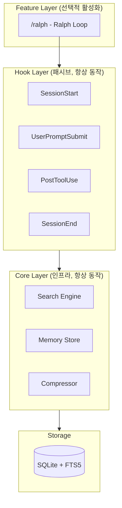
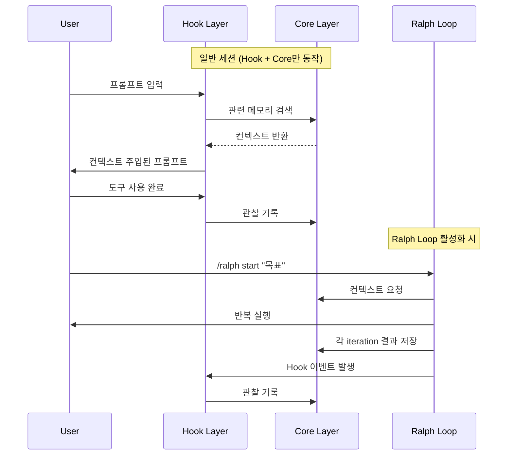
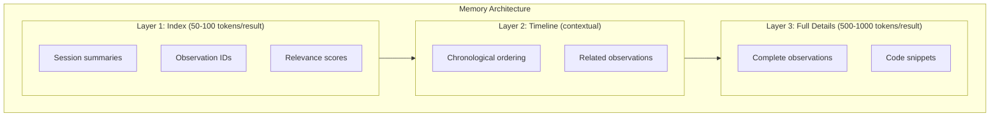
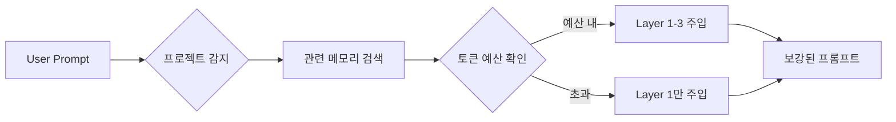
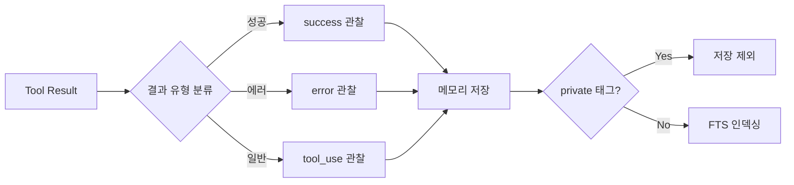
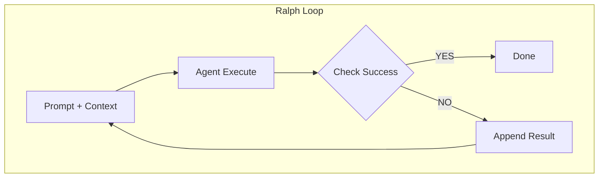
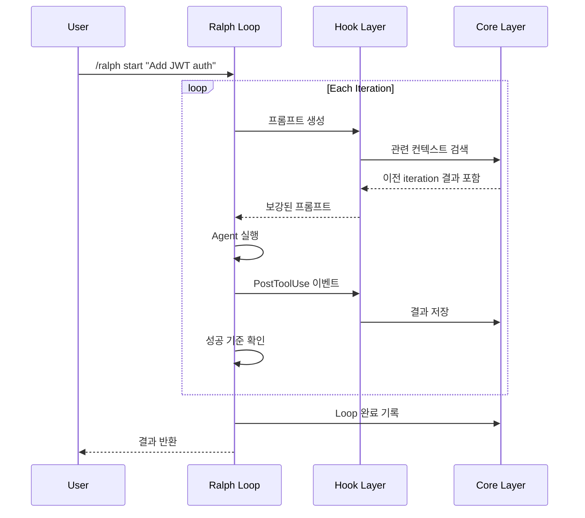
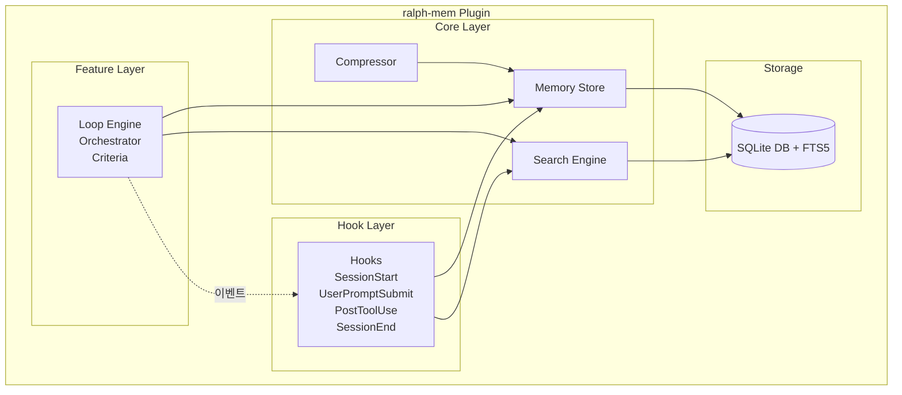
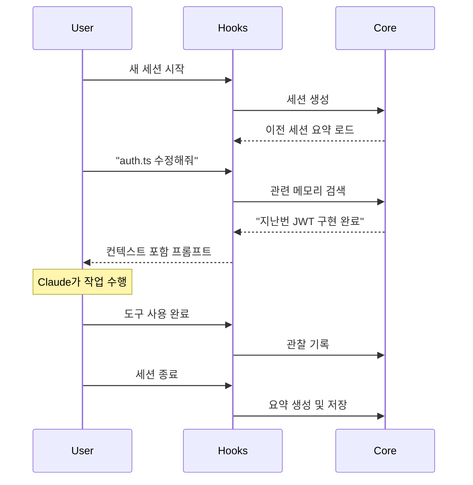
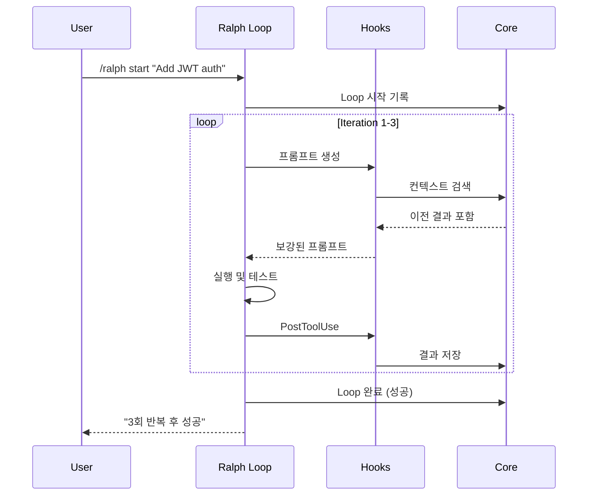

# ralph-mem PRD (Product Requirements Document)

## 1. 개요

### 1.1 제품명

**ralph-mem** - Claude Code를 위한 지속적 컨텍스트 관리 플러그인

### 1.2 문제 정의

LLM 기반 코딩 에이전트는 다음과 같은 핵심 한계를 가진다:

| 문제              | 설명                                                         |
| ----------------- | ------------------------------------------------------------ |
| **Context Rot**   | 누적된 불필요한 정보로 인한 모델 성능 저하                   |
| **Compaction**    | context window의 60-70% 초과 시 출력 품질 급락 ("dumb zone") |
| **Forgetfulness** | 세션 간 작업 맥락 손실                                       |
| **One-shot 실패** | 복잡한 작업에서 단일 시도로는 성공률 저조                    |

### 1.3 솔루션

[claude-mem](https://github.com/thedotmack/claude-mem)의 "지능적 컨텍스트 관리"와 [Ralph Loop](https://ghuntley.com/ralph/)의 "끈질긴 반복" 철학을 레이어로 분리하여 결합:

1. **Core Layer**: 항상 동작하는 메모리 저장/검색 인프라
2. **Hook Layer**: 패시브하게 컨텍스트를 주입/기록하는 자동화 레이어
3. **Feature Layer**: 명시적으로 활성화하는 Ralph Loop 기능

---

## 2. 목표 및 비목표

### 2.1 목표

1. 세션 간 지속적 메모리를 통한 컨텍스트 연속성 보장 (Core)
2. Hook 기반 자동 컨텍스트 주입/기록 (Hook Layer)
3. 성공 기준 기반 자동 반복 실행 지원 (Feature Layer)
4. Context rot 및 compaction 문제 자동 완화

### 2.2 비목표

1. Claude Code 외 다른 AI 에이전트 지원 (v1 범위 외)
2. 멀티 에이전트 오케스트레이션 ("Gas Town") (v2 이후)
3. 클라우드 기반 메모리 동기화 (로컬 전용)

---

## 3. 아키텍처 레이어

### 3.1 레이어 개요



### 3.2 레이어 비교

| 구분       | Core Layer           | Hook Layer              | Feature Layer        |
| ---------- | -------------------- | ----------------------- | -------------------- |
| **동작**   | 항상                 | 항상 (패시브)           | 명시적 활성화        |
| **역할**   | 저장/검색 인프라     | 자동 주입/기록          | 목표 달성까지 반복   |
| **트리거** | API 호출             | Claude Code 이벤트      | `/ralph start`       |
| **의존성** | 없음                 | Core Layer              | Core + Hook Layer    |

### 3.3 레이어 간 상호작용



---

## 4. Core Layer: 메모리 시스템

### 4.1 Storage Schema

```sql
-- 세션 테이블
CREATE TABLE sessions (
    id TEXT PRIMARY KEY,
    project_path TEXT NOT NULL,
    started_at DATETIME DEFAULT CURRENT_TIMESTAMP,
    ended_at DATETIME,
    summary TEXT,
    tags TEXT  -- JSON array
);

-- 관찰 테이블
CREATE TABLE observations (
    id TEXT PRIMARY KEY,
    session_id TEXT REFERENCES sessions(id),
    type TEXT NOT NULL,  -- 'tool_use', 'error', 'success', 'note'
    content TEXT NOT NULL,
    metadata TEXT,  -- JSON
    created_at DATETIME DEFAULT CURRENT_TIMESTAMP
);

-- Loop 실행 테이블
CREATE TABLE loop_runs (
    id TEXT PRIMARY KEY,
    session_id TEXT REFERENCES sessions(id),
    goal TEXT NOT NULL,
    iterations INTEGER DEFAULT 0,
    status TEXT NOT NULL,  -- 'running', 'success', 'failed', 'stopped'
    context_snapshots TEXT,  -- JSON array
    started_at DATETIME DEFAULT CURRENT_TIMESTAMP,
    ended_at DATETIME
);

-- FTS5 전문 검색
CREATE VIRTUAL TABLE observations_fts USING fts5(
    content,
    content=observations,
    content_rowid=rowid
);
```

### 4.2 메모리 계층 구조 (Progressive Disclosure)



### 4.3 Memory Search API

```typescript
interface MemorySearchOptions {
  query: string;
  project?: string;
  timeRange?: { start: Date; end: Date };
  types?: ObservationType[];
  limit?: number;
  layer?: 1 | 2 | 3;  // Progressive disclosure
}

interface SearchResult {
  layer1: IndexResult[];      // Compact (IDs + scores)
  layer2?: TimelineResult[];  // Contextual
  layer3?: FullResult[];      // Complete details
  tokenEstimate: number;
}
```

### 4.4 Context Budget Enforcement

| 영역                  | 비율 |
| --------------------- | ---- |
| System Prompt         | 10%  |
| Injected Memory       | 15%  |
| Current Task Context  | 35%  |
| Reserved for Response | 40%  |

**Context Trimming Strategy:**

| 전략            | 적용 시점   | 방법                     |
| --------------- | ----------- | ------------------------ |
| **Recency**     | 기본        | 오래된 컨텍스트부터 제거 |
| **Relevance**   | 검색 시     | 관련성 낮은 항목 제외    |
| **Compression** | 임계치 도달 | AI 요약으로 압축         |
| **Selective**   | Loop 중     | 성공/실패 핵심만 유지    |

---

## 5. Hook Layer: 자동 컨텍스트 관리

### 5.1 Lifecycle Hooks

| Hook               | 시점             | 동작                             |
| ------------------ | ---------------- | -------------------------------- |
| `SessionStart`     | 세션 시작        | 세션 생성, 프로젝트 컨텍스트 로드 |
| `UserPromptSubmit` | 프롬프트 제출 전 | 관련 메모리 검색 및 주입         |
| `PostToolUse`      | 도구 사용 후     | 도구 결과를 관찰로 기록          |
| `SessionEnd`       | 세션 종료        | 세션 요약 생성 및 저장           |

### 5.2 UserPromptSubmit 상세



**주입되는 컨텍스트:**
- 최근 세션 요약 (동일 프로젝트)
- 관련 관찰 (키워드 매칭)
- 진행 중인 Loop 상태 (있는 경우)

### 5.3 PostToolUse 상세



**기록되는 정보:**
- 도구 이름 및 파라미터
- 실행 결과 (성공/실패)
- 관련 파일 경로
- 에러 메시지 (있는 경우)

---

## 6. Feature Layer: Ralph Loop

### 6.1 Ralph Loop 원리



**핵심 원칙:**

- 단일 목표 집중 (Single Goal Focus)
- 결정론적 컨텍스트 관리 (Deterministic Context Allocation)
- 성공 기준 명시 (Explicit Success Criteria)
- 과열 방지 (Overbaking Prevention)

### 6.2 Loop Configuration

```yaml
ralph:
  max_iterations: 10          # 최대 반복 횟수
  success_criteria:
    - type: test_pass         # 테스트 통과
    - type: build_success     # 빌드 성공
    - type: custom            # 사용자 정의 조건
      command: "npm run lint"
      expected_exit_code: 0
  context_budget: 0.6         # context window 사용률 상한 (60%)
  cooldown_ms: 1000           # 반복 간 대기 시간
```

### 6.3 Loop Commands

| Command               | 설명                        |
| --------------------- | --------------------------- |
| `/ralph start <goal>` | 목표와 함께 Ralph Loop 시작 |
| `/ralph stop`         | 현재 Loop 중단              |
| `/ralph status`       | Loop 상태 및 진행률 확인    |
| `/ralph config`       | Loop 설정 조회/변경         |

### 6.4 Success Criteria Types

| Type            | 설명             | 예시                 |
| --------------- | ---------------- | -------------------- |
| `test_pass`     | 테스트 명령 성공 | `npm test`, `pytest` |
| `build_success` | 빌드 명령 성공   | `npm run build`      |
| `lint_clean`    | Lint 오류 없음   | `eslint`, `ruff`     |
| `type_check`    | 타입 체크 통과   | `tsc --noEmit`       |
| `custom`        | 사용자 정의 명령 | 임의 shell command   |
| `marker`        | 특정 출력 마커   | `[RALPH_SUCCESS]`    |

### 6.5 Ralph Loop와 Hook Layer 통합

Ralph Loop 실행 중에도 Hook Layer가 동작:

1. 각 iteration에서 `PostToolUse` hook이 도구 결과 기록
2. 다음 iteration에서 `UserPromptSubmit` hook이 이전 결과 주입
3. Loop 종료 시 전체 실행 기록이 메모리에 저장



---

## 7. Skills (Slash Commands)

| Skill         | 레이어  | 설명                                 |
| ------------- | ------- | ------------------------------------ |
| `/ralph`      | Feature | Ralph Loop 제어                      |
| `/mem-search` | Core    | 메모리 검색 (Progressive Disclosure) |
| `/mem-inject` | Core    | 수동 컨텍스트 주입                   |
| `/mem-forget` | Core    | 특정 메모리 제거                     |
| `/mem-status` | Core    | 메모리 사용량 및 상태                |

---

## 8. 비기능 요구사항

### 8.1 성능

| 지표                       | 목표    |
| -------------------------- | ------- |
| 메모리 검색 응답 시간      | < 200ms |
| Hook 실행 오버헤드         | < 50ms  |
| 세션 시작 시 메모리 주입   | < 500ms |
| SQLite DB 크기 (1000 세션) | < 100MB |

### 8.2 안정성

- Loop 중 비정상 종료 시 상태 자동 복구
- DB 손상 시 자동 백업 복원
- Hook 실패 시 세션 계속 진행 (graceful degradation)

### 8.3 보안

- `<private>` 태그로 민감 정보 저장 제외
- 로컬 전용 저장 (네트워크 전송 없음)
- DB 파일 접근 권한 제한 (600)

---

## 9. 기술 아키텍처

### 9.1 컴포넌트 다이어그램



### 9.2 파일 구조

```text
ralph-mem/
├── plugin.json              # Claude Code 플러그인 매니페스트
├── package.json
├── tsconfig.json
├── src/
│   ├── index.ts             # 플러그인 진입점
│   ├── core/                # Core Layer
│   │   ├── store.ts         # Memory Store
│   │   ├── search.ts        # Search Engine
│   │   ├── compressor.ts    # Compressor
│   │   └── db/
│   │       ├── schema.ts
│   │       ├── migrations/
│   │       └── client.ts
│   ├── hooks/               # Hook Layer
│   │   ├── session-start.ts
│   │   ├── user-prompt-submit.ts
│   │   ├── post-tool-use.ts
│   │   └── session-end.ts
│   ├── features/            # Feature Layer
│   │   └── ralph/
│   │       ├── engine.ts
│   │       ├── criteria.ts
│   │       └── commands.ts
│   ├── skills/              # Slash Commands
│   │   ├── ralph.ts
│   │   ├── mem-search.ts
│   │   ├── mem-inject.ts
│   │   └── mem-status.ts
│   └── utils/
│       ├── tokens.ts
│       └── config.ts
├── prompts/
│   └── compressor.md
├── docs/
│   ├── PRD.md
│   └── ARCHITECTURE.md
└── tests/
    ├── core/
    ├── hooks/
    └── features/
```

### 9.3 기술 스택

| 분류     | 기술          | 이유                        |
| -------- | ------------- | --------------------------- |
| Runtime  | Bun           | 빠른 시작 시간, SQLite 내장 |
| Language | TypeScript    | 타입 안정성                 |
| Database | SQLite + FTS5 | 로컬 전용, 전문 검색        |
| Testing  | Vitest        | Bun 호환, 빠른 실행         |

---

## 10. 사용자 시나리오

### 10.1 시나리오 1: Hook만 사용 (일반 세션)



### 10.2 시나리오 2: Ralph Loop 활성화



### 10.3 시나리오 3: 메모리 검색

```text
사용자: /mem-search "authentication error handling"

[Layer 1 결과 - 50 tokens]
Found 5 relevant observations:
1. [obs-a1b2] Session 2024-01-15: JWT error handling
2. [obs-c3d4] Session 2024-01-14: Auth middleware errors
3. [obs-e5f6] Session 2024-01-10: Login validation
...

사용자: /mem-search --layer 3 obs-a1b2

[Layer 3 결과 - 800 tokens]
Full observation:
- Session: 2024-01-15 (JWT 인증 구현)
- Type: tool_use
- Content:
  auth.ts에 다음 에러 핸들링 추가:
  - TokenExpiredError → 401 + refresh 안내
  - InvalidTokenError → 401 + 재로그인 요청
  ...
```

---

## 11. 태스크 리스트

> 상세 태스크는 [TASKS.md](../TASKS.md)에서 관리합니다.

| Phase                 | 태스크 수 | 주요 내용                                    |
| --------------------- | --------- | -------------------------------------------- |
| Phase 1: Core Layer   | 6         | DB, Memory Store, Search Engine              |
| Phase 2: Hook Layer   | 6         | SessionStart, UserPromptSubmit, PostToolUse  |
| Phase 3: Feature Layer | 8        | Ralph Loop Engine, Success Criteria          |
| Phase 4: Polish       | 12        | 테스트, 추가 Skills, 문서화                  |

---

## 12. 성공 지표

| 지표                 | 목표   | 측정 방법                   |
| -------------------- | ------ | --------------------------- |
| 메모리 주입 활용률   | > 50%  | 주입된 컨텍스트 실제 참조율 |
| Hook 실행 성공률     | > 99%  | 실패 없이 완료된 Hook 비율  |
| Loop 성공률          | > 70%  | 성공/전체 Loop 비율         |
| 평균 Loop 반복 횟수  | < 5회  | 성공 Loop의 평균 iteration  |

---

## 13. 참고 자료

- [Ralph Loop - Geoffrey Huntley](https://ghuntley.com/ralph/)
- [claude-mem - thedotmack](https://github.com/thedotmack/claude-mem)
- [Claude Code Hooks Documentation](https://docs.anthropic.com/claude-code/hooks)
- [The Brief History of Ralph](https://www.humanlayer.dev/blog/brief-history-of-ralph)

---

## 14. 변경 이력

| 버전 | 날짜       | 작성자 | 변경 내용                                        |
| ---- | ---------- | ------ | ------------------------------------------------ |
| 0.1  | 2025-01-17 | -      | 초안 작성                                        |
| 0.2  | 2025-01-17 | -      | 다이어그램 Mermaid 변환, 마일스톤→태스크 리스트  |
| 0.3  | 2025-01-17 | -      | 3-Layer 아키텍처 분리 (Core/Hook/Feature)        |
