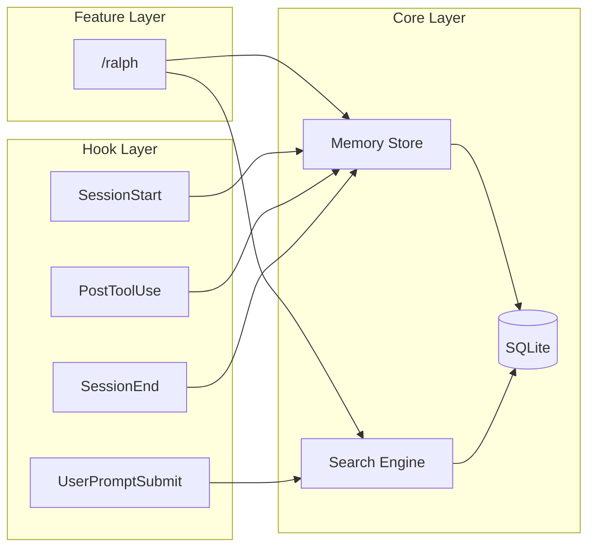
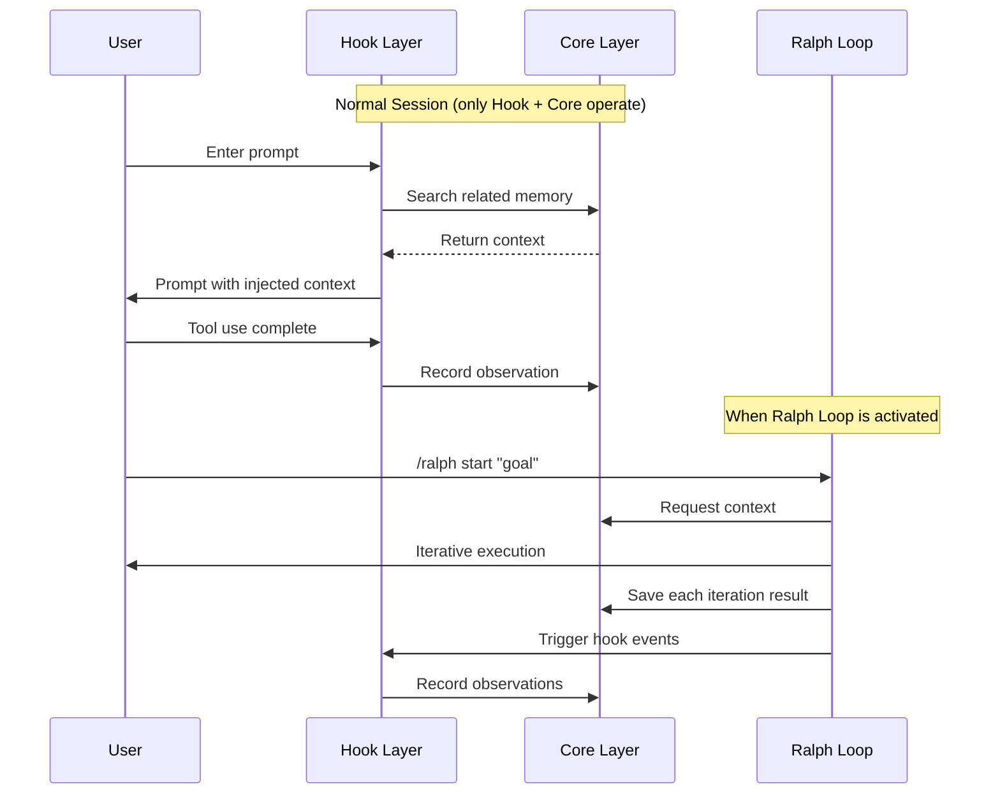
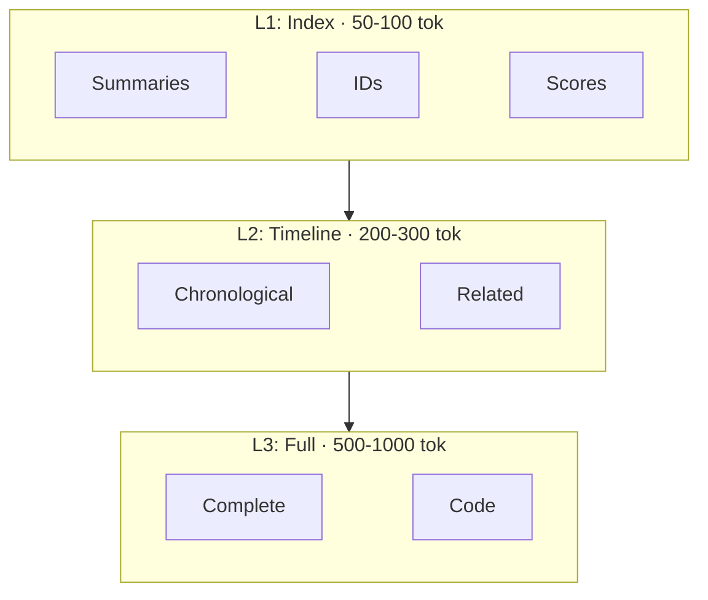
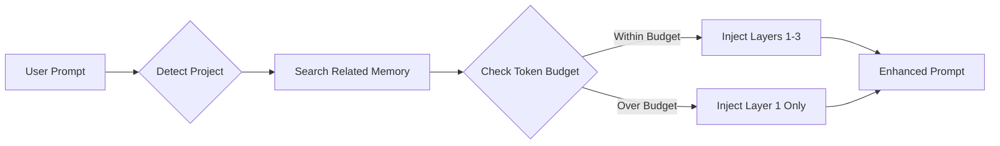
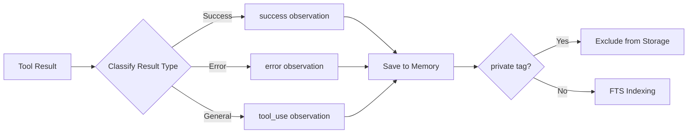
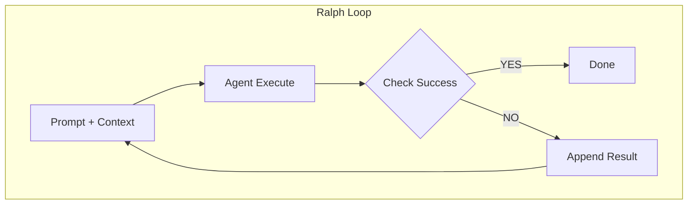
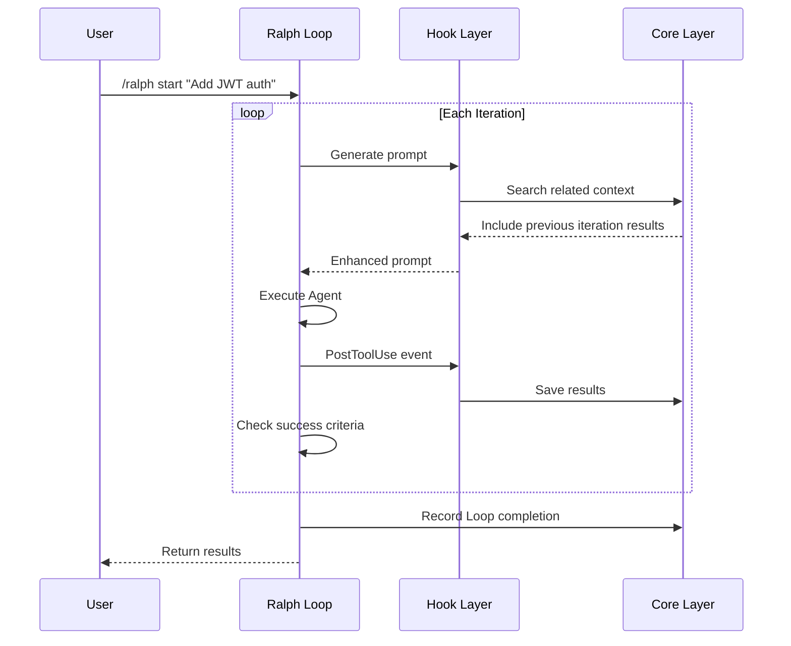
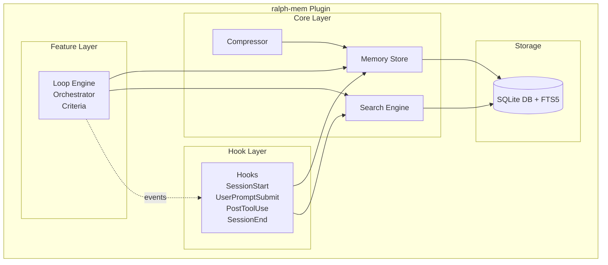
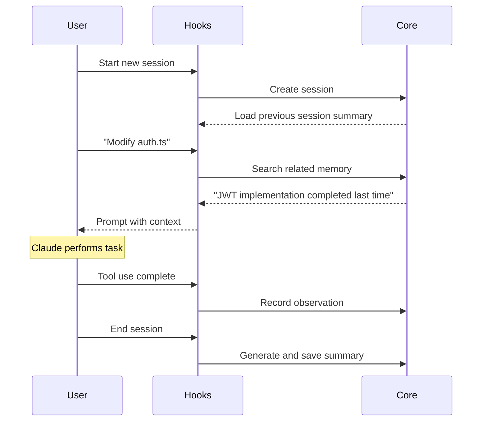
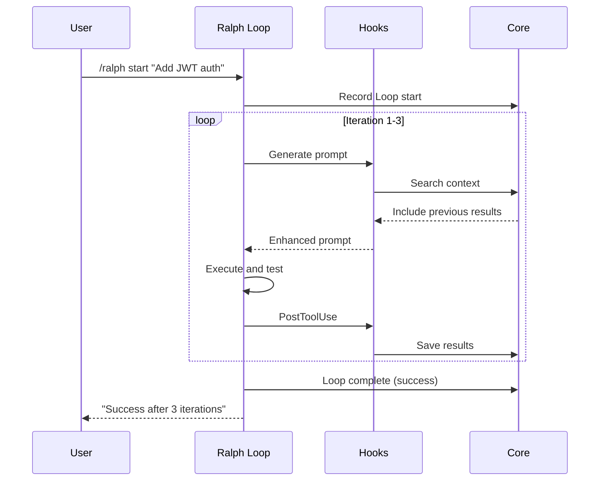

# ralph-mem PRD (Product Requirements Document)

**[한국어 버전 (Korean)](./PRD.ko.md)**

## 1. Overview

### 1.1 Product Name

**ralph-mem** - A persistent context management plugin for Claude Code

### 1.2 Problem Definition

LLM-based coding agents have the following core limitations:

| Problem           | Description                                                          |
| ----------------- | -------------------------------------------------------------------- |
| **Context Rot**   | Model performance degradation due to accumulated irrelevant info     |
| **Compaction**    | Output quality drops sharply when context window exceeds 60-70% ("dumb zone") |
| **Forgetfulness** | Loss of work context between sessions                                |
| **One-shot Failure** | Low success rate for complex tasks in single attempts             |

### 1.3 Solution

Combines [claude-mem](https://github.com/thedotmack/claude-mem)'s "intelligent context management" with [Ralph Loop](https://ghuntley.com/ralph/)'s "persistent iteration" philosophy into separate layers:

1. **Core Layer**: Always-on memory storage/retrieval infrastructure
2. **Hook Layer**: Passive automation layer for context injection/recording
3. **Feature Layer**: Explicitly activated Ralph Loop functionality

---

## 2. Goals and Non-Goals

### 2.1 Goals

1. Ensure context continuity through persistent cross-session memory (Core)
2. Hook-based automatic context injection/recording (Hook Layer)
3. Support automatic iterative execution based on success criteria (Feature Layer)
4. Automatically mitigate context rot and compaction issues

### 2.2 Non-Goals

1. Support for AI agents other than Claude Code (out of v1 scope)
2. Multi-agent orchestration ("Gas Town") (v2+)
3. Cloud-based memory synchronization (local only)

---

## 3. Architecture Layers

### 3.1 Layer Overview



### 3.2 Layer Comparison

| Aspect     | Core Layer           | Hook Layer              | Feature Layer        |
| ---------- | -------------------- | ----------------------- | -------------------- |
| **Operation** | Always            | Always (passive)        | Explicit activation  |
| **Role**   | Storage/retrieval    | Auto injection/recording | Repeat until goal    |
| **Trigger** | API call            | Claude Code events      | `/ralph start`       |
| **Dependencies** | None           | Core Layer              | Core + Hook Layer    |

### 3.3 Inter-Layer Interaction



---

## 4. Core Layer: Memory System

### 4.1 Storage Schema

```sql
-- Sessions table
CREATE TABLE sessions (
    id TEXT PRIMARY KEY,
    project_path TEXT NOT NULL,
    started_at DATETIME DEFAULT CURRENT_TIMESTAMP,
    ended_at DATETIME,
    summary TEXT,
    tags TEXT  -- JSON array
);

-- Observations table
CREATE TABLE observations (
    id TEXT PRIMARY KEY,
    session_id TEXT REFERENCES sessions(id),
    type TEXT NOT NULL,  -- 'tool_use', 'error', 'success', 'note'
    content TEXT NOT NULL,
    metadata TEXT,  -- JSON
    created_at DATETIME DEFAULT CURRENT_TIMESTAMP
);

-- Loop runs table
CREATE TABLE loop_runs (
    id TEXT PRIMARY KEY,
    session_id TEXT REFERENCES sessions(id),
    goal TEXT NOT NULL,
    iterations INTEGER DEFAULT 0,
    status TEXT NOT NULL,  -- 'running', 'success', 'failed', 'stopped'
    context_snapshots TEXT,  -- JSON array
    started_at DATETIME DEFAULT CURRENT_TIMESTAMP,
    ended_at DATETIME
);

-- FTS5 full-text search
CREATE VIRTUAL TABLE observations_fts USING fts5(
    content,
    content=observations,
    content_rowid=rowid
);
```

### 4.2 Memory Hierarchy (Progressive Disclosure)



### 4.3 Memory Search API

```typescript
interface MemorySearchOptions {
  query: string;
  project?: string;
  timeRange?: { start: Date; end: Date };
  types?: ObservationType[];
  limit?: number;
  layer?: 1 | 2 | 3;  // Progressive disclosure
}

interface SearchResult {
  layer1: IndexResult[];      // Compact (IDs + scores)
  layer2?: TimelineResult[];  // Contextual
  layer3?: FullResult[];      // Complete details
  tokenEstimate: number;
}
```

### 4.4 Context Budget Enforcement

| Area                  | Ratio |
| --------------------- | ----- |
| System Prompt         | 10%   |
| Injected Memory       | 15%   |
| Current Task Context  | 35%   |
| Reserved for Response | 40%   |

**Context Trimming Strategy:**

| Strategy        | Application   | Method                        |
| --------------- | ------------- | ----------------------------- |
| **Recency**     | Default       | Remove older context first    |
| **Relevance**   | During search | Exclude low-relevance items   |
| **Compression** | At threshold  | AI summary compression        |
| **Selective**   | During Loop   | Keep only success/failure key points |

---

## 5. Hook Layer: Automatic Context Management

### 5.1 Lifecycle Hooks

| Hook               | Timing           | Action                            |
| ------------------ | ---------------- | --------------------------------- |
| `SessionStart`     | Session start    | Create session, load project context |
| `UserPromptSubmit` | Before prompt    | Search and inject related memory  |
| `PostToolUse`      | After tool use   | Record tool result as observation |
| `SessionEnd`       | Session end      | Generate and save session summary |

### 5.2 UserPromptSubmit Details



**Injected Context:**
- Recent session summaries (same project)
- Related observations (keyword matching)
- Active Loop status (if any)

### 5.3 PostToolUse Details



**Recorded Information:**
- Tool name and parameters
- Execution result (success/failure)
- Related file paths
- Error messages (if any)

---

## 6. Feature Layer: Ralph Loop

### 6.1 Ralph Loop Principle



**Core Principles:**

- Single Goal Focus
- Deterministic Context Allocation
- Explicit Success Criteria
- Overbaking Prevention

### 6.2 Loop Configuration

```yaml
ralph:
  max_iterations: 10          # Maximum iterations
  success_criteria:
    - type: test_pass         # Test pass
    - type: build_success     # Build success
    - type: custom            # Custom condition
      command: "npm run lint"
      expected_exit_code: 0
  context_budget: 0.6         # Context window usage limit (60%)
  cooldown_ms: 1000           # Wait time between iterations
```

### 6.3 Loop Commands

| Command               | Description                  |
| --------------------- | ---------------------------- |
| `/ralph start <goal>` | Start Ralph Loop with goal   |
| `/ralph stop`         | Stop current Loop            |
| `/ralph status`       | Check Loop status & progress |
| `/ralph config`       | View/modify Loop settings    |

### 6.4 Success Criteria Types

| Type            | Description      | Example              |
| --------------- | ---------------- | -------------------- |
| `test_pass`     | Test command passes | `npm test`, `pytest` |
| `build_success` | Build command passes | `npm run build`     |
| `lint_clean`    | No lint errors   | `eslint`, `ruff`     |
| `type_check`    | Type check passes | `tsc --noEmit`      |
| `custom`        | User-defined command | Any shell command   |
| `marker`        | Specific output marker | `[RALPH_SUCCESS]`  |

### 6.5 Ralph Loop and Hook Layer Integration

Hook Layer operates during Ralph Loop execution:

1. `PostToolUse` hook records tool results for each iteration
2. `UserPromptSubmit` hook injects previous results for next iteration
3. Entire execution record is saved to memory on Loop completion



---

## 7. Skills (Slash Commands)

| Skill         | Layer   | Description                          |
| ------------- | ------- | ------------------------------------ |
| `/ralph`      | Feature | Ralph Loop control                   |
| `/mem-search` | Core    | Memory search (Progressive Disclosure) |
| `/mem-inject` | Core    | Manual context injection             |
| `/mem-forget` | Core    | Remove specific memory               |
| `/mem-status` | Core    | Memory usage and status              |

---

## 8. Non-Functional Requirements

### 8.1 Performance

| Metric                     | Target  |
| -------------------------- | ------- |
| Memory search response     | < 200ms |
| Hook execution overhead    | < 50ms  |
| Memory injection at session start | < 500ms |
| SQLite DB size (1000 sessions) | < 100MB |

### 8.2 Reliability

- Automatic state recovery on abnormal Loop termination
- Automatic backup restoration on DB corruption
- Session continues on hook failure (graceful degradation)

### 8.3 Security

- `<private>` tag to exclude sensitive info from storage
- Local-only storage (no network transmission)
- DB file access restricted (600)

---

## 9. Technical Architecture

### 9.1 Component Diagram



### 9.2 File Structure

```text
ralph-mem/
├── plugin.json              # Claude Code plugin manifest
├── package.json
├── tsconfig.json
├── src/
│   ├── index.ts             # Plugin entry point
│   ├── core/                # Core Layer
│   │   ├── store.ts         # Memory Store
│   │   ├── search.ts        # Search Engine
│   │   ├── compressor.ts    # Compressor
│   │   └── db/
│   │       ├── schema.ts
│   │       ├── migrations/
│   │       └── client.ts
│   ├── hooks/               # Hook Layer
│   │   ├── session-start.ts
│   │   ├── user-prompt-submit.ts
│   │   ├── post-tool-use.ts
│   │   └── session-end.ts
│   ├── features/            # Feature Layer
│   │   └── ralph/
│   │       ├── engine.ts
│   │       ├── criteria.ts
│   │       └── commands.ts
│   ├── skills/              # Slash Commands
│   │   ├── ralph.ts
│   │   ├── mem-search.ts
│   │   ├── mem-inject.ts
│   │   └── mem-status.ts
│   └── utils/
│       ├── tokens.ts
│       └── config.ts
├── prompts/
│   └── compressor.md
├── docs/
│   ├── PRD.md
│   └── ARCHITECTURE.md
└── tests/
    ├── core/
    ├── hooks/
    └── features/
```

### 9.3 Tech Stack

| Category | Technology     | Reason                              |
| -------- | -------------- | ----------------------------------- |
| Runtime  | Bun            | Fast startup, built-in SQLite       |
| Language | TypeScript     | Type safety                         |
| Database | SQLite + FTS5  | Local-only, full-text search        |
| Testing  | Bun Test       | Bun compatible, fast execution      |

---

## 10. User Scenarios

### 10.1 Scenario 1: Hooks Only (Normal Session)



### 10.2 Scenario 2: Ralph Loop Activated



### 10.3 Scenario 3: Memory Search

```text
User: /mem-search "authentication error handling"

[Layer 1 Result - 50 tokens]
Found 5 relevant observations:
1. [obs-a1b2] Session 2024-01-15: JWT error handling
2. [obs-c3d4] Session 2024-01-14: Auth middleware errors
3. [obs-e5f6] Session 2024-01-10: Login validation
...

User: /mem-search --layer 3 obs-a1b2

[Layer 3 Result - 800 tokens]
Full observation:
- Session: 2024-01-15 (JWT auth implementation)
- Type: tool_use
- Content:
  Added following error handling to auth.ts:
  - TokenExpiredError → 401 + refresh guidance
  - InvalidTokenError → 401 + re-login request
  ...
```

---

## 11. Task List

> Detailed tasks are managed in [TASKS.md](../TASKS.md).

| Phase                 | Tasks | Key Contents                              |
| --------------------- | ----- | ----------------------------------------- |
| Phase 1: Core Layer   | 6     | DB, Memory Store, Search Engine           |
| Phase 2: Hook Layer   | 6     | SessionStart, UserPromptSubmit, PostToolUse |
| Phase 3: Feature Layer | 8    | Ralph Loop Engine, Success Criteria       |
| Phase 4: Polish       | 12    | Tests, Additional Skills, Documentation   |

---

## 12. Success Metrics

| Metric               | Target | Measurement                   |
| -------------------- | ------ | ----------------------------- |
| Memory injection usage | > 50% | Actual reference rate of injected context |
| Hook execution success | > 99% | Ratio of hooks completed without failure |
| Loop success rate    | > 70%  | Success/total Loop ratio      |
| Average Loop iterations | < 5  | Average iterations for successful Loops |

---

## 13. References

- [Ralph Loop - Geoffrey Huntley](https://ghuntley.com/ralph/)
- [claude-mem - thedotmack](https://github.com/thedotmack/claude-mem)
- [Claude Code Hooks Documentation](https://docs.anthropic.com/claude-code/hooks)
- [The Brief History of Ralph](https://www.humanlayer.dev/blog/brief-history-of-ralph)

---

## 14. Change History

| Version | Date       | Author | Changes                                      |
| ------- | ---------- | ------ | -------------------------------------------- |
| 0.1     | 2025-01-17 | -      | Initial draft                                |
| 0.2     | 2025-01-17 | -      | Convert diagrams to Mermaid, milestones→tasks |
| 0.3     | 2025-01-17 | -      | 3-Layer architecture separation (Core/Hook/Feature) |
