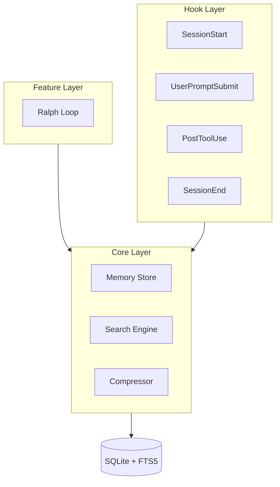

# ralph-mem 설계 문서

> 상세 설계 결정 사항 인덱스

## 아키텍처 개요

## 문서 목록

| 문서 | 내용 | 주요 결정 |
|------|------|----------|
| [core-layer.md](core-layer.md) | Storage, Search, Embedding | FTS5 우선, paraphrase-multilingual |
| [hook-layer.md](hook-layer.md) | Lifecycle hooks 동작 | 쓰기 도구 + Bash 기록, 요약 알림 |
| [ralph-loop.md](ralph-loop.md) | Loop engine 설계 | Claude 판단, 복합 중단 조건 |
| [storage-schema.md](storage-schema.md) | DB 스키마 상세 | 글로벌 + 프로젝트 저장소 |
| [ux-decisions.md](ux-decisions.md) | UI/UX 결정 사항 | 상세 상태, 대화형 설정 |
| [error-handling.md](error-handling.md) | 에러 처리 전략 | 3단계 심각도, 사용자 선택 |
| [config-system.md](config-system.md) | 설정 시스템 | 프로젝트 > 글로벌 우선순위 |

## 핵심 설계 결정

### Core Layer

- **검색**: FTS5 전문 검색 우선, Embedding 폴백
- **임베딩**: paraphrase-multilingual-MiniLM-L12-v2 (한/영 지원)
- **압축**: 유형 기반 (error/success 유지, tool_use 요약)
- **정리**: 30일 후 요약 후 삭제

### Hook Layer

- **기록 대상**: 쓰기 도구 (Edit, Write) + 모든 Bash
- **알림 형식**: 요약 목록 (상세 내용 미포함)
- **요약 시점**: 세션 종료 + 30분 주기

### Feature Layer (Ralph Loop)

- **성공 판단**: Claude가 테스트 출력 전체 분석
- **Overbaking 방지**: 반복 + 시간 + 진척 없음 복합 조건
- **롤백**: 변경 파일 스냅샷, 실패 시 안내

### Storage

- **위치**: 글로벌 (`~/.config/ralph-mem/`) + 프로젝트 (`.ralph-mem/`)
- **백업**: 세션마다 자동 백업
- **.gitignore**: 자동 추가

### UX

- **초기 설정**: 프로젝트 감지 기반 대화형
- **Loop 상태**: 상세 진행 상황 표시
- **이전 세션**: 자동 표시

### Error Handling

- **심각도**: Low / Medium / High 3단계
- **Graceful degradation**: 사용자 선택 기반
- **로깅**: 기본 Info 레벨

## 관련 문서

- [PRD](../PRD.md) - 요구사항 정의서
- [TASKS.md](../../TASKS.md) - 구현 태스크 목록
