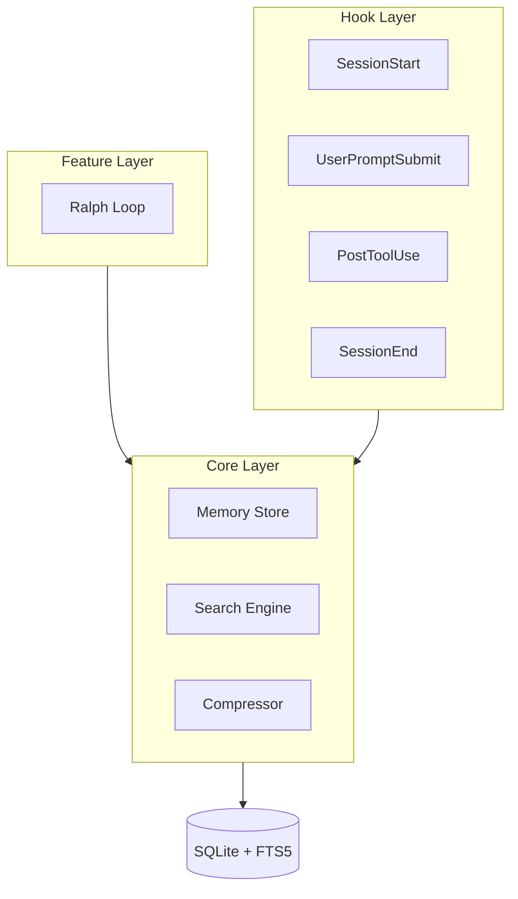

# ralph-mem Design Documents

> Detailed design decision index

**[한국어 버전 (Korean)](./README.ko.md)**

## Architecture Overview

## Document List

| Document | Content | Key Decisions |
|----------|---------|---------------|
| [core-layer.md](core-layer.md) | Storage, Search, Embedding | FTS5 first, paraphrase-multilingual |
| [hook-layer.md](hook-layer.md) | Lifecycle hooks behavior | Write tools + Bash recording, summary notification |
| [ralph-loop.md](ralph-loop.md) | Loop engine design | Claude-based judgment, composite stop conditions |
| [storage-schema.md](storage-schema.md) | DB schema details | Global + project storage |
| [ux-decisions.md](ux-decisions.md) | UI/UX decisions | Detailed status, interactive config |
| [error-handling.md](error-handling.md) | Error handling strategy | 3-level severity, user choice |
| [config-system.md](config-system.md) | Config system | Project > Global priority |

## Key Design Decisions

### Core Layer

- **Search**: FTS5 full-text search first, Embedding fallback
- **Embedding**: paraphrase-multilingual-MiniLM-L12-v2 (Korean/English support)
- **Compression**: Type-based (keep error/success, summarize tool_use)
- **Cleanup**: Summarize and delete after 30 days

### Hook Layer

- **Recording targets**: Write tools (Edit, Write) + all Bash
- **Notification format**: Summary list (no detailed content)
- **Summary timing**: Session end + 30 minute intervals

### Feature Layer (Ralph Loop)

- **Success judgment**: Claude analyzes entire test output
- **Overbaking prevention**: Composite conditions (iterations + time + no progress)
- **Rollback**: Changed file snapshots, guidance on failure

### Storage

- **Location**: Global (`~/.config/ralph-mem/`) + project (`.ralph-mem/`)
- **Backup**: Automatic per-session backup
- **.gitignore**: Auto-added

### UX

- **Initial setup**: Project detection-based interactive
- **Loop status**: Detailed progress display
- **Previous session**: Auto-display

### Error Handling

- **Severity**: Low / Medium / High (3 levels)
- **Graceful degradation**: User choice-based
- **Logging**: Default Info level

## Related Documents

- [PRD](../PRD.md) - Product Requirements Document
- [Issues](../issues/README.md) - Implementation Tasks
