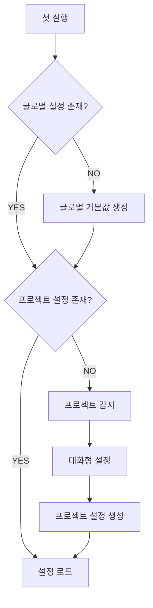

# Config System

> 설정 시스템 설계

## 설정 위치

| 위치 | 경로 | 용도 |
|------|------|------|
| 글로벌 | `~/.config/ralph-mem/config.yaml` | 기본 설정 |
| 프로젝트 | `.ralph-mem/config.yaml` | 프로젝트별 오버라이드 |

## 우선순위

**프로젝트 설정 > 글로벌 설정 > 기본값**

```typescript
function loadConfig(projectPath: string): Config {
  const defaults = getDefaultConfig();
  const global = loadYaml('~/.config/ralph-mem/config.yaml');
  const project = loadYaml(`${projectPath}/.ralph-mem/config.yaml`);

  return deepMerge(defaults, global, project);
}
```

## 설정 스키마

### 전체 구조

```yaml
# ralph-mem 설정
ralph:
  max_iterations: 10
  context_budget: 0.6
  cooldown_ms: 1000
  success_criteria:
    - type: test_pass
      command: "npm test"

memory:
  auto_inject: true
  max_inject_tokens: 2000
  retention_days: 30

search:
  fts_first: true
  embedding_fallback: true
  default_limit: 10

privacy:
  exclude_patterns:
    - "*.env"
    - "*password*"
    - "*secret*"

logging:
  level: info
  file: true
```

### ralph 섹션

| 키 | 타입 | 기본값 | 설명 |
|-----|------|--------|------|
| `max_iterations` | number | 10 | 최대 반복 횟수 |
| `context_budget` | number | 0.6 | context window 사용률 상한 |
| `cooldown_ms` | number | 1000 | 반복 간 대기 시간 |
| `success_criteria` | array | - | 성공 기준 목록 |

### memory 섹션

| 키 | 타입 | 기본값 | 설명 |
|-----|------|--------|------|
| `auto_inject` | boolean | true | 세션 시작 시 자동 주입 |
| `max_inject_tokens` | number | 2000 | 주입 최대 토큰 |
| `retention_days` | number | 30 | 메모리 보관 기간 |

### search 섹션

| 키 | 타입 | 기본값 | 설명 |
|-----|------|--------|------|
| `fts_first` | boolean | true | FTS5 우선 검색 |
| `embedding_fallback` | boolean | true | 임베딩 폴백 활성화 |
| `default_limit` | number | 10 | 기본 검색 결과 수 |

### privacy 섹션

| 키 | 타입 | 기본값 | 설명 |
|-----|------|--------|------|
| `exclude_patterns` | string[] | ["*.env", ...] | 기록 제외 패턴 |

## .gitignore 자동 추가

프로젝트 초기화 시 `.gitignore`에 자동 추가:

```typescript
async function ensureGitignore(projectPath: string): Promise<void> {
  const gitignorePath = `${projectPath}/.gitignore`;
  const entry = '\n# ralph-mem\n.ralph-mem/\n';

  if (await exists(gitignorePath)) {
    const content = await readFile(gitignorePath, 'utf-8');
    if (!content.includes('.ralph-mem/')) {
      await appendFile(gitignorePath, entry);
    }
  } else {
    await writeFile(gitignorePath, entry);
  }
}
```

## 초기 설정 흐름



### 프로젝트 감지

```typescript
interface ProjectDetection {
  type: 'nodejs' | 'python' | 'rust' | 'go' | 'unknown';
  testCommand?: string;
  buildCommand?: string;
  lintCommand?: string;
}

async function detectProject(path: string): Promise<ProjectDetection> {
  if (await exists(`${path}/package.json`)) {
    const pkg = await readJson(`${path}/package.json`);
    return {
      type: 'nodejs',
      testCommand: pkg.scripts?.test,
      buildCommand: pkg.scripts?.build,
      lintCommand: pkg.scripts?.lint
    };
  }
  // ... 다른 프로젝트 유형 감지
}
```

## 설정 명령어

```bash
# 현재 설정 조회
/ralph config

# 특정 값 수정
/ralph config set ralph.max_iterations 15

# 프로젝트 설정 초기화
/ralph config init
```
