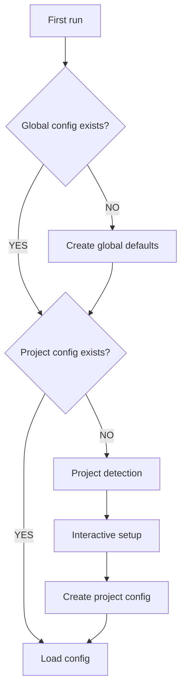

# Config System

> Configuration system design

**[한국어 버전 (Korean)](./config-system.ko.md)**

## Config Locations

| Location | Path | Purpose |
|----------|------|---------|
| Global | `~/.config/ralph-mem/config.yaml` | Default settings |
| Project | `.ralph-mem/config.yaml` | Per-project overrides |

## Priority

**Project settings > Global settings > Defaults**

```typescript
function loadConfig(projectPath: string): Config {
  const defaults = getDefaultConfig();
  const global = loadYaml('~/.config/ralph-mem/config.yaml');
  const project = loadYaml(`${projectPath}/.ralph-mem/config.yaml`);

  return deepMerge(defaults, global, project);
}
```

## Config Schema

### Full Structure

```yaml
# ralph-mem configuration
ralph:
  max_iterations: 10
  context_budget: 0.6
  cooldown_ms: 1000
  success_criteria:
    - type: test_pass
      command: "npm test"

memory:
  auto_inject: true
  max_inject_tokens: 2000
  retention_days: 30

search:
  fts_first: true
  embedding_fallback: true
  default_limit: 10

privacy:
  exclude_patterns:
    - "*.env"
    - "*password*"
    - "*secret*"

logging:
  level: info
  file: true
```

### ralph Section

| Key | Type | Default | Description |
|-----|------|---------|-------------|
| `max_iterations` | number | 10 | Maximum iteration count |
| `context_budget` | number | 0.6 | Context window usage limit |
| `cooldown_ms` | number | 1000 | Wait time between iterations |
| `success_criteria` | array | - | List of success criteria |

### memory Section

| Key | Type | Default | Description |
|-----|------|---------|-------------|
| `auto_inject` | boolean | true | Auto-inject at session start |
| `max_inject_tokens` | number | 2000 | Maximum injection tokens |
| `retention_days` | number | 30 | Memory retention period |

### search Section

| Key | Type | Default | Description |
|-----|------|---------|-------------|
| `fts_first` | boolean | true | FTS5 priority search |
| `embedding_fallback` | boolean | true | Enable embedding fallback |
| `default_limit` | number | 10 | Default search result count |

### privacy Section

| Key | Type | Default | Description |
|-----|------|---------|-------------|
| `exclude_patterns` | string[] | ["*.env", ...] | Patterns to exclude from recording |

## Auto-add to .gitignore

Auto-add to `.gitignore` on project initialization:

```typescript
async function ensureGitignore(projectPath: string): Promise<void> {
  const gitignorePath = `${projectPath}/.gitignore`;
  const entry = '\n# ralph-mem\n.ralph-mem/\n';

  if (await exists(gitignorePath)) {
    const content = await readFile(gitignorePath, 'utf-8');
    if (!content.includes('.ralph-mem/')) {
      await appendFile(gitignorePath, entry);
    }
  } else {
    await writeFile(gitignorePath, entry);
  }
}
```

## Initial Setup Flow



### Project Detection

```typescript
interface ProjectDetection {
  type: 'nodejs' | 'python' | 'rust' | 'go' | 'unknown';
  testCommand?: string;
  buildCommand?: string;
  lintCommand?: string;
}

async function detectProject(path: string): Promise<ProjectDetection> {
  if (await exists(`${path}/package.json`)) {
    const pkg = await readJson(`${path}/package.json`);
    return {
      type: 'nodejs',
      testCommand: pkg.scripts?.test,
      buildCommand: pkg.scripts?.build,
      lintCommand: pkg.scripts?.lint
    };
  }
  // ... detect other project types
}
```

## Config Commands

```bash
# View current config
/ralph config

# Modify specific value
/ralph config set ralph.max_iterations 15

# Initialize project config
/ralph config init
```
