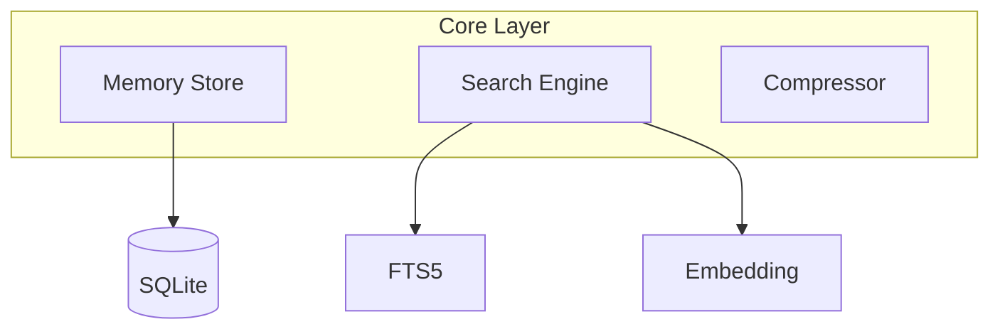

# Core Layer

> Memory Store, Search Engine, Embedding 설계

## 개요

Core Layer는 항상 활성화된 인프라로, Hook Layer와 Feature Layer에 서비스를 제공합니다.



## Memory Store

### 책임

- Observation CRUD 작업
- Session 관리
- 토큰 카운트 추적

### 인터페이스

```typescript
interface MemoryStore {
  // Session
  createSession(projectPath: string): Promise<Session>;
  endSession(id: string, summary: string): Promise<void>;

  // Observation
  addObservation(obs: CreateObservation): Promise<Observation>;
  getObservation(id: string): Promise<Observation | null>;

  // Cleanup
  summarizeAndDelete(before: Date): Promise<void>;
}
```

### 메모리 정리

30일 이상 된 observation은 요약 후 삭제:

1. 오래된 observation 조회
2. Claude에게 요약 요청
3. 요약을 새 observation으로 저장
4. 원본 삭제

## Search Engine

### 검색 우선순위

1. **FTS5 전문 검색** (기본)
2. **Embedding 유사도** (FTS5 결과 부족 시 폴백)

### 인터페이스

```typescript
interface SearchEngine {
  search(query: string, options?: SearchOptions): Promise<SearchResult[]>;
  searchByEmbedding(embedding: number[]): Promise<SearchResult[]>;
}

interface SearchOptions {
  limit?: number;           // 기본: 10
  layer?: 1 | 2 | 3;        // Progressive Disclosure
  since?: Date;
  types?: ObservationType[];
}
```

### Progressive Disclosure

| Layer | 내용 | 토큰 |
|-------|------|------|
| 1 | ID + 점수 + 한줄 요약 | ~50/건 |
| 2 | 시간순 컨텍스트 | ~200/건 |
| 3 | 전체 상세 | ~500/건 |

```typescript
// Layer 1 예시
{ id: "obs-a1b2", score: 0.92, summary: "JWT 인증 미들웨어 구현" }

// Layer 3 예시
{ id: "obs-a1b2", score: 0.92,
  content: "// Full tool output...",
  session: { ... },
  relatedObs: [...] }
```

## Embedding

### 모델 선택

**paraphrase-multilingual-MiniLM-L12-v2**

| 항목 | 값 |
|------|-----|
| 크기 | ~278MB |
| 차원 | 384 |
| 언어 | 50+ (한국어, 영어 포함) |
| 성능 | 빠른 추론 속도 |

### 비동기 생성

임베딩은 백그라운드에서 비동기 생성:

```typescript
async function addObservation(obs: CreateObservation) {
  // 1. 즉시 저장 (embedding 없이)
  const saved = await store.insert(obs);

  // 2. 백그라운드에서 embedding 생성
  queueMicrotask(async () => {
    const embedding = await embedder.encode(obs.content);
    await store.updateEmbedding(saved.id, embedding);
  });

  return saved;
}
```

### 로컬 실행

```typescript
import { pipeline } from '@xenova/transformers';

const embedder = await pipeline(
  'feature-extraction',
  'Xenova/paraphrase-multilingual-MiniLM-L12-v2'
);

async function encode(text: string): Promise<number[]> {
  const result = await embedder(text, {
    pooling: 'mean',
    normalize: true
  });
  return Array.from(result.data);
}
```

## Compressor

### 압축 전략: 유형 기반

| 유형 | 압축 방식 |
|------|----------|
| `tool_use` | 도구명 + 결과 요약 |
| `bash` | 명령어 + 출력 요약 |
| `error` | 전체 유지 (디버깅용) |
| `success` | 전체 유지 (성공 패턴) |

### 인터페이스

```typescript
interface Compressor {
  compress(obs: Observation): Promise<string>;
  shouldCompress(obs: Observation): boolean;
}
```

### Context Budget

- 상한: context window의 60%
- 초과 시: 자동 압축 실행
- 우선순위: 오래된 것부터 압축
