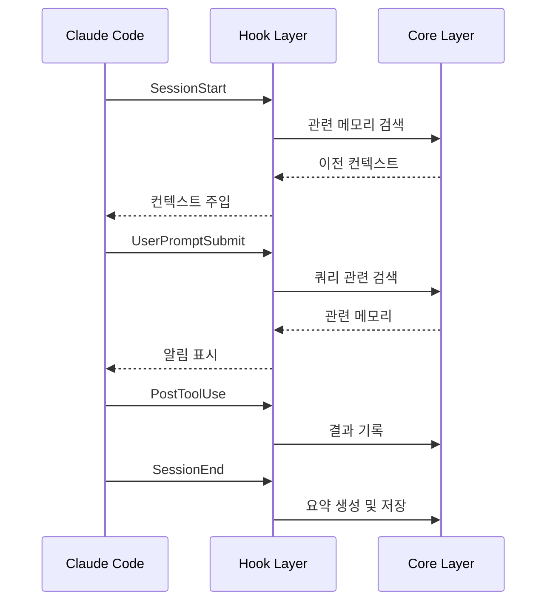

# Hook Layer

> Lifecycle Hooks 동작 설계

## 개요

Hook Layer는 Claude Code의 lifecycle에 연결되어 **수동적으로** 동작합니다.
사용자가 명시적으로 활성화하지 않아도 항상 작동합니다.



## SessionStart

세션 시작 시 이전 작업 컨텍스트를 자동 주입합니다.

### 동작

1. 프로젝트 경로로 관련 세션 검색
2. 최근 세션 요약 조회
3. 컨텍스트 주입 (max_inject_tokens 이내)

### 출력 형식

```
📝 이전 세션 컨텍스트:
- [1/15] JWT 인증 미들웨어 구현 완료
- [1/14] 사용자 모델 스키마 정의
- [1/13] Express 프로젝트 초기화
```

## UserPromptSubmit

사용자 프롬프트 제출 시 관련 메모리를 검색합니다.

### 동작

1. 프롬프트에서 키워드 추출
2. FTS5 + Embedding으로 관련 메모리 검색
3. 요약 알림 표시 (상세 내용은 주입하지 않음)

### 알림 형식

```
🔍 관련 메모리 발견:
- JWT 인증 (1/15, 관련도: 0.92)
- 에러 처리 패턴 (1/14, 관련도: 0.85)
상세 조회: /mem-search --layer 3 <id>
```

### 왜 알림만?

- 불필요한 컨텍스트 주입 방지
- 사용자가 필요 시 명시적으로 조회
- 토큰 효율성 유지

## PostToolUse

도구 사용 후 결과를 메모리에 기록합니다.

### 기록 대상

| 도구 유형 | 기록 여부 | 이유 |
|----------|----------|------|
| 쓰기 도구 (Edit, Write) | ✅ | 코드 변경 추적 |
| Bash | ✅ | 명령 실행 결과 |
| 읽기 도구 (Read, Glob) | ❌ | 정보 조회만 |
| 검색 도구 (Grep) | ❌ | 탐색 활동만 |

### 기록 내용

```typescript
interface ToolObservation {
  type: 'tool_use' | 'bash';
  tool_name: string;
  content: string;        // 도구 출력
  importance: number;     // 0.0 ~ 1.0
}
```

### 중요도 산정

| 조건 | 중요도 |
|------|--------|
| 에러 발생 | 1.0 |
| 테스트 통과/실패 | 0.9 |
| 파일 생성/수정 | 0.7 |
| 일반 명령 | 0.5 |

## SessionEnd

세션 종료 시 요약을 생성하고 저장합니다.

### 요약 시점

| 시점 | 동작 |
|------|------|
| 세션 종료 | 전체 세션 요약 생성 |
| 주기적 (30분) | 중간 요약 생성 (긴 세션용) |

### 요약 생성

Claude (현재 세션)를 사용하여 요약 생성:

```typescript
async function generateSummary(session: Session): Promise<string> {
  const observations = await store.getObservations(session.id);

  const prompt = `
    다음 세션의 작업 내용을 요약해주세요:
    - 주요 작업
    - 해결한 문제
    - 남은 이슈

    ${formatObservations(observations)}
  `;

  return await claude.complete(prompt);
}
```

### 요약 저장

```typescript
await store.endSession(session.id, {
  summary: generatedSummary,
  summary_embedding: await embedder.encode(generatedSummary)
});
```

## Privacy 필터

기록 전 민감 정보 필터링:

```yaml
privacy:
  exclude_patterns:
    - "*.env"
    - "*password*"
    - "*secret*"
    - "*api_key*"
```

### 필터 동작

```typescript
function shouldRecord(content: string, config: Config): boolean {
  return !config.privacy.exclude_patterns.some(pattern =>
    minimatch(content, pattern)
  );
}
```
