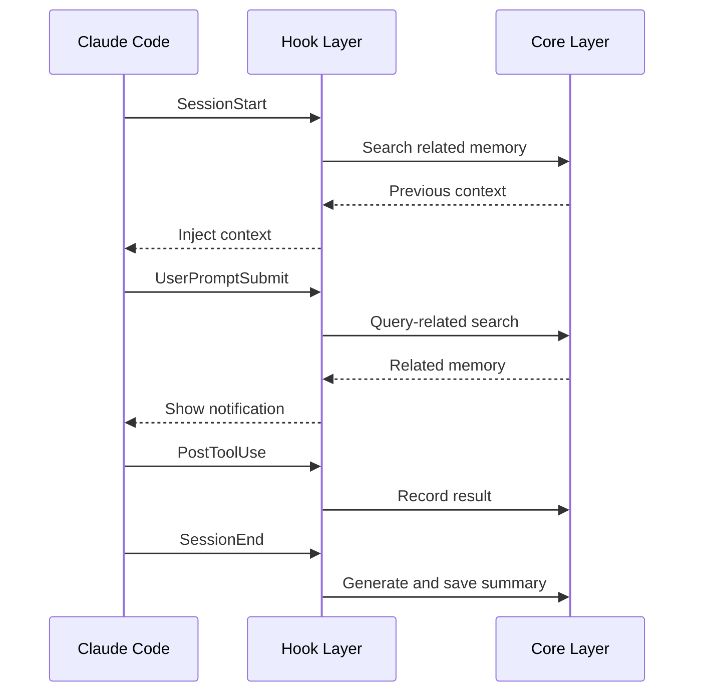

# Hook Layer

> Lifecycle Hooks behavior design

**[한국어 버전 (Korean)](./hook-layer.ko.md)**

## Overview

Hook Layer connects to Claude Code's lifecycle and operates **passively**.
It always works without explicit user activation.



## SessionStart

Automatically injects previous work context at session start.

### Behavior

1. Search related sessions by project path
2. Query recent session summaries
3. Inject context (within max_inject_tokens)

### Output Format

```
📝 Previous session context:
- [1/15] JWT auth middleware implementation complete
- [1/14] User model schema definition
- [1/13] Express project initialization
```

## UserPromptSubmit

Searches related memory when user submits a prompt.

### Behavior

1. Extract keywords from prompt
2. Search related memory via FTS5 + Embedding
3. Show summary notification (don't inject detailed content)

### Notification Format

```
🔍 Related memory found:
- JWT authentication (1/15, relevance: 0.92)
- Error handling patterns (1/14, relevance: 0.85)
View details: /mem-search --layer 3 <id>
```

### Why Notification Only?

- Prevent unnecessary context injection
- User explicitly queries when needed
- Maintain token efficiency

## PostToolUse

Records tool usage results to memory.

### Recording Targets

| Tool Type | Record | Reason |
|-----------|--------|--------|
| Write tools (Edit, Write) | ✅ | Track code changes |
| Bash | ✅ | Command execution results |
| Read tools (Read, Glob) | ❌ | Information retrieval only |
| Search tools (Grep) | ❌ | Exploration activity only |

### Recorded Content

```typescript
interface ToolObservation {
  type: 'tool_use' | 'bash';
  tool_name: string;
  content: string;        // Tool output
  importance: number;     // 0.0 ~ 1.0
}
```

### Importance Scoring

| Condition | Importance |
|-----------|------------|
| Error occurred | 1.0 |
| Test pass/fail | 0.9 |
| File create/modify | 0.7 |
| General command | 0.5 |

## SessionEnd

Generates and saves summary at session end.

### Summary Timing

| Timing | Action |
|--------|--------|
| Session end | Generate full session summary |
| Periodic (30 min) | Generate intermediate summary (for long sessions) |

### Summary Generation

Use Claude (current session) to generate summary:

```typescript
async function generateSummary(session: Session): Promise<string> {
  const observations = await store.getObservations(session.id);

  const prompt = `
    Please summarize the following session work:
    - Main tasks
    - Problems solved
    - Remaining issues

    ${formatObservations(observations)}
  `;

  return await claude.complete(prompt);
}
```

### Summary Storage

```typescript
await store.endSession(session.id, {
  summary: generatedSummary,
  summary_embedding: await embedder.encode(generatedSummary)
});
```

## Privacy Filter

Filter sensitive information before recording:

```yaml
privacy:
  exclude_patterns:
    - "*.env"
    - "*password*"
    - "*secret*"
    - "*api_key*"
```

### Filter Behavior

```typescript
function shouldRecord(content: string, config: Config): boolean {
  return !config.privacy.exclude_patterns.some(pattern =>
    minimatch(content, pattern)
  );
}
```
