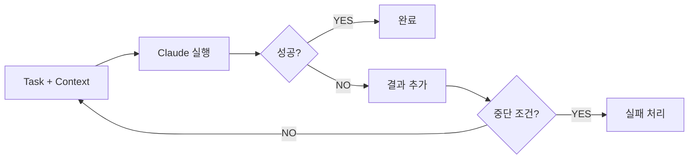
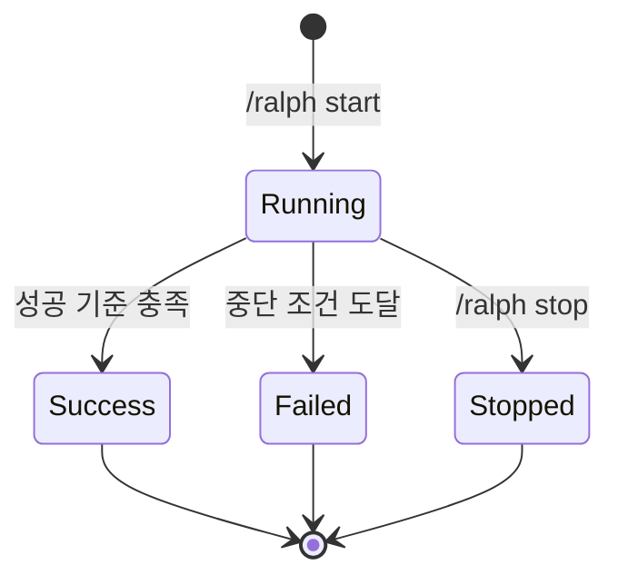

# Ralph Loop

> Loop Engine 설계

## 개요

Ralph Loop는 성공 기준 달성까지 자동으로 반복 실행하는 Feature Layer 구성요소입니다.
사용자가 `/ralph start`로 명시적으로 활성화합니다.



## 성공 판단

### Claude 기반 판단

테스트 출력 전체를 Claude에게 전달하여 성공 여부를 판단합니다.

```typescript
interface SuccessJudgment {
  success: boolean;
  reason: string;
  suggestions?: string[];
}

async function judgeSuccess(criteria: SuccessCriteria, output: string): Promise<SuccessJudgment>;
```

### 지원 기준

| 기준 | 명령어 예시 | 판단 방식 |
|------|------------|----------|
| `test_pass` | `npm test` | 테스트 결과 분석 |
| `build_success` | `npm run build` | 빌드 로그 분석 |
| `lint_clean` | `npm run lint` | lint 출력 분석 |
| `type_check` | `tsc --noEmit` | 타입 에러 분석 |
| `custom` | 사용자 정의 | 출력 기반 분석 |

## Overbaking 방지

### 복합 중단 조건

| 조건                   | 기본값 | 설명                 |
| ---------------------- | ------ | -------------------- |
| `maxIterations`        | 10     | 최대 반복 횟수       |
| `maxDurationMs`        | 30분   | 최대 실행 시간       |
| `noProgressThreshold`  | 3회    | 진척 없음 허용 횟수  |

```typescript
function shouldStop(run: LoopRun, conditions: StopConditions): StopReason | null {
  if (run.iterations >= conditions.maxIterations) return { reason: 'max_iterations' };
  if (Date.now() - run.startedAt >= conditions.maxDurationMs) return { reason: 'max_duration' };
  if (run.noProgressCount >= conditions.noProgressThreshold) return { reason: 'no_progress' };
  return null;
}
```

### 진척 없음 감지

Claude가 이전/현재 결과를 비교하여 종합 판단:

- 에러 수 감소 여부
- 새로운 접근 시도 여부
- 문제 해결 진척 여부

## 파일 스냅샷

### 스냅샷 범위

변경된 파일만 스냅샷 (git diff 활용):

```typescript
async function createSnapshot(run: LoopRun): Promise<string> {
  const snapshotDir = `.ralph-mem/snapshots/${run.id}`;
  const changedFiles = await getChangedFiles(); // git diff
  for (const file of changedFiles) {
    await copyFile(file, `${snapshotDir}/${file}`);
  }
  return snapshotDir;
}
```

### 롤백

Loop 실패 시 롤백 안내:

```text
❌ Loop 실패 (5회 시도)
💾 스냅샷: .ralph-mem/snapshots/loop-xyz

롤백: /ralph rollback
수동: cp -r .ralph-mem/snapshots/loop-xyz/* ./
```

## Loop 상태 관리

### 상태 전이



### 상태 인터페이스

```typescript
interface LoopRun {
  id: string;
  sessionId: string;
  task: string;
  criteria: SuccessCriteria;
  status: 'running' | 'success' | 'failed' | 'stopped';
  iterations: number;
  maxIterations: number;
  noProgressCount: number;
  startedAt: number;
  endedAt?: number;
  snapshotPath: string;
  lastOutput?: string;
}
```

## Hook 통합

Loop 실행 중 Hook Layer가 자동으로 각 iteration 결과를 기록:

```typescript
// PostToolUse hook에서
if (loopEngine.isRunning()) {
  observation.loopRunId = loopEngine.currentRun.id;
  observation.iteration = loopEngine.currentRun.iterations;
}
```

## 명령어

| 명령어 | 동작 |
|--------|------|
| `/ralph start <task>` | Loop 시작 |
| `/ralph start <task> --criteria <type>` | 특정 기준으로 시작 |
| `/ralph stop` | 현재 Loop 중단 |
| `/ralph status` | Loop 상태 조회 |
| `/ralph rollback` | 스냅샷으로 롤백 |
