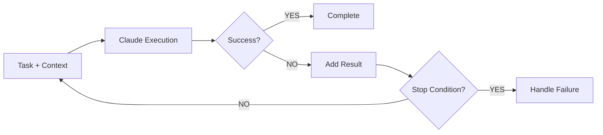
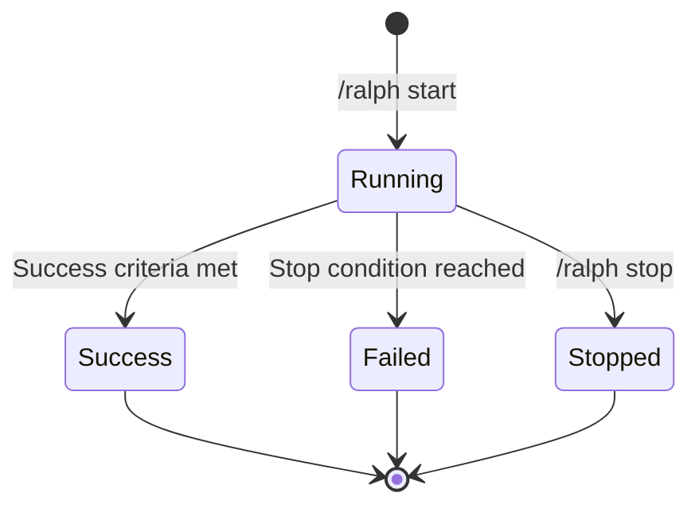

# Ralph Loop

> Loop Engine design

**[한국어 버전 (Korean)](./ralph-loop.ko.md)**

## Overview

Ralph Loop is a Feature Layer component that automatically iterates until success criteria are met.
Users explicitly activate it with `/ralph start`.



## Success Judgment

### Claude-based Judgment

Pass the entire test output to Claude to determine success.

```typescript
interface SuccessJudgment {
  success: boolean;
  reason: string;
  suggestions?: string[];
}

async function judgeSuccess(criteria: SuccessCriteria, output: string): Promise<SuccessJudgment>;
```

### Supported Criteria

| Criteria | Command Example | Judgment Method |
|----------|-----------------|-----------------|
| `test_pass` | `npm test` | Test result analysis |
| `build_success` | `npm run build` | Build log analysis |
| `lint_clean` | `npm run lint` | Lint output analysis |
| `type_check` | `tsc --noEmit` | Type error analysis |
| `custom` | User-defined | Output-based analysis |

## Overbaking Prevention

### Composite Stop Conditions

| Condition | Default | Description |
|-----------|---------|-------------|
| `maxIterations` | 10 | Maximum iteration count |
| `maxDurationMs` | 30 min | Maximum execution time |
| `noProgressThreshold` | 3 | No-progress tolerance count |

```typescript
function shouldStop(run: LoopRun, conditions: StopConditions): StopReason | null {
  if (run.iterations >= conditions.maxIterations) return { reason: 'max_iterations' };
  if (Date.now() - run.startedAt >= conditions.maxDurationMs) return { reason: 'max_duration' };
  if (run.noProgressCount >= conditions.noProgressThreshold) return { reason: 'no_progress' };
  return null;
}
```

### No-Progress Detection

Claude compares previous/current results for comprehensive judgment:

- Whether error count decreased
- Whether new approaches were attempted
- Whether problem-solving progress was made

## File Snapshot

### Snapshot Scope

Only snapshot changed files (using git diff):

```typescript
async function createSnapshot(run: LoopRun): Promise<string> {
  const snapshotDir = `.ralph-mem/snapshots/${run.id}`;
  const changedFiles = await getChangedFiles(); // git diff
  for (const file of changedFiles) {
    await copyFile(file, `${snapshotDir}/${file}`);
  }
  return snapshotDir;
}
```

### Rollback

Provide rollback guidance on Loop failure:

```text
❌ Loop failed (5 attempts)
💾 Snapshot: .ralph-mem/snapshots/loop-xyz

Rollback: /ralph rollback
Manual: cp -r .ralph-mem/snapshots/loop-xyz/* ./
```

## Loop State Management

### State Transitions



### State Interface

```typescript
interface LoopRun {
  id: string;
  sessionId: string;
  task: string;
  criteria: SuccessCriteria;
  status: 'running' | 'success' | 'failed' | 'stopped';
  iterations: number;
  maxIterations: number;
  noProgressCount: number;
  startedAt: number;
  endedAt?: number;
  snapshotPath: string;
  lastOutput?: string;
}
```

## Hook Integration

Hook Layer automatically records each iteration result during Loop execution:

```typescript
// In PostToolUse hook
if (loopEngine.isRunning()) {
  observation.loopRunId = loopEngine.currentRun.id;
  observation.iteration = loopEngine.currentRun.iterations;
}
```

## Commands

| Command | Action |
|---------|--------|
| `/ralph start <task>` | Start Loop |
| `/ralph start <task> --criteria <type>` | Start with specific criteria |
| `/ralph stop` | Stop current Loop |
| `/ralph status` | Check Loop status |
| `/ralph rollback` | Rollback to snapshot |
