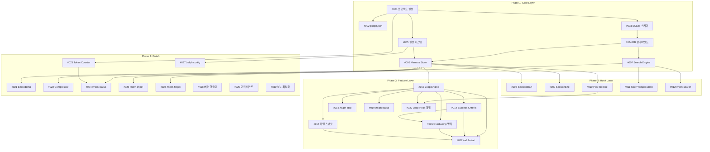

# ralph-mem 이슈 목록

> 의존성을 고려하여 분할된 구현 태스크

## 폴더 구조

각 이슈는 개별 폴더로 관리됩니다:

```text
docs/issues/
├── 001-project-setup/
│   ├── README.md      # 이슈 내용
│   └── evidence.md    # 완료 검증 (완료 시)
├── 002-plugin-manifest/
│   └── README.md
└── ...
```

## 의존성 그래프



## 이슈 목록

### Phase 1: Core Layer (7개)

| # | 이슈 | 의존성 | 설명 |
|---|------|--------|------|
| 001 | [프로젝트 설정](001-project-setup/) | - | Bun, TypeScript, Vitest 설정 |
| 002 | [plugin.json](002-plugin-manifest/) | #001 | 플러그인 매니페스트 |
| 003 | [SQLite 스키마](003-sqlite-schema/) | #001 | DB 스키마 및 마이그레이션 |
| 004 | [DB 클라이언트](004-db-client/) | #003 | CRUD 클라이언트 |
| 005 | [설정 시스템](005-config-system/) | #001 | 글로벌/프로젝트 설정 |
| 006 | [Memory Store](006-memory-store/) | #004, #005 | 고수준 메모리 관리 |
| 007 | [Search Engine](007-search-engine-fts/) | #004 | FTS5 전문 검색 |

### Phase 2: Hook Layer (5개)

| # | 이슈 | 의존성 | 설명 |
|---|------|--------|------|
| 008 | [SessionStart](008-session-start-hook/) | #006 | 세션 시작 hook |
| 009 | [SessionEnd](009-session-end-hook/) | #006 | 세션 종료 hook |
| 010 | [PostToolUse](010-post-tool-use-hook/) | #006 | 도구 사용 후 hook |
| 011 | [UserPromptSubmit](011-user-prompt-submit-hook/) | #007 | 프롬프트 제출 hook |
| 012 | [/mem-search](012-mem-search-skill/) | #007 | 메모리 검색 skill |

### Phase 3: Feature Layer (8개)

| # | 이슈 | 의존성 | 설명 |
|---|------|--------|------|
| 013 | [Loop Engine](013-loop-engine-base/) | #006 | 기본 반복 엔진 |
| 014 | [Success Criteria](014-success-criteria/) | #013 | 성공 기준 평가기 |
| 015 | [Overbaking 방지](015-overbaking-prevention/) | #013, #014 | 중단 조건 |
| 016 | [파일 스냅샷](016-file-snapshot/) | #013 | 스냅샷 및 롤백 |
| 017 | [/ralph start](017-ralph-start-command/) | #013-016 | Loop 시작 명령 |
| 018 | [/ralph stop](018-ralph-stop-command/) | #013 | Loop 중단 명령 |
| 019 | [/ralph status](019-ralph-status-command/) | #013 | 상태 조회 명령 |
| 020 | [Loop-Hook 통합](020-loop-hook-integration/) | #010, #013 | Hook과 Loop 연동 |

### Phase 4: Polish (10개)

| # | 이슈 | 의존성 | 설명 |
|---|------|--------|------|
| 021 | [Embedding](021-embedding-service/) | #007 | 의미 기반 검색 |
| 022 | [Compressor](022-compressor/) | #006 | AI 기반 압축 |
| 023 | [Token Counter](023-token-counter/) | #001 | 토큰 계산 |
| 024 | [/mem-status](024-mem-status-skill/) | #006, #023 | 상태 조회 skill |
| 025 | [/mem-inject](025-mem-inject-skill/) | #006 | 수동 주입 skill |
| 026 | [/mem-forget](026-mem-forget-skill/) | #006 | 삭제 skill |
| 027 | [/ralph config](027-ralph-config-command/) | #005 | 설정 명령 |
| 028 | [에러 핸들링](028-error-handling/) | #006, #007, #013 | Graceful degradation |
| 029 | [단위 테스트](029-unit-tests/) | 전체 | 80% 커버리지 |
| 030 | [성능 최적화](030-performance-optimization/) | #007, #021 | 벤치마크 및 최적화 |

## 권장 작업 순서

1. **Week 1**: #001 → #002, #003, #005 (병렬)
2. **Week 2**: #004 → #006, #007 (병렬)
3. **Week 3**: #008-#012 (Hook Layer)
4. **Week 4**: #013 → #014, #016 → #015
5. **Week 5**: #017-#020 (Ralph 명령어)
6. **Week 6+**: Phase 4 (우선순위에 따라)

## 이슈 작업 프로세스

1. 이슈 폴더의 `README.md` 확인
2. 의존성 그래프에 따라 순서대로 구현
3. 완료 시 인수조건 체크 (`[x]`)
4. 같은 폴더에 `evidence.md` 작성
5. `README.md`에 evidence 링크 추가

## 이슈 상태 범례

- 미시작
- 진행 중
- 완료
- 차단됨
