# ralph-mem 이슈 목록

> 의존성을 고려하여 분할된 구현 태스크

## 의존성 그래프

```mermaid
flowchart TB
    subgraph Phase1["Phase 1: Core Layer"]
        I001[#001 프로젝트 설정]
        I002[#002 plugin.json]
        I003[#003 SQLite 스키마]
        I004[#004 DB 클라이언트]
        I005[#005 설정 시스템]
        I006[#006 Memory Store]
        I007[#007 Search Engine]

        I001 --> I002
        I001 --> I003
        I001 --> I005
        I003 --> I004
        I004 --> I006
        I005 --> I006
        I004 --> I007
    end

    subgraph Phase2["Phase 2: Hook Layer"]
        I008[#008 SessionStart]
        I009[#009 SessionEnd]
        I010[#010 PostToolUse]
        I011[#011 UserPromptSubmit]
        I012[#012 /mem-search]

        I006 --> I008
        I006 --> I009
        I006 --> I010
        I007 --> I011
        I007 --> I012
    end

    subgraph Phase3["Phase 3: Feature Layer"]
        I013[#013 Loop Engine]
        I014[#014 Success Criteria]
        I015[#015 Overbaking 방지]
        I016[#016 파일 스냅샷]
        I017[#017 /ralph start]
        I018[#018 /ralph stop]
        I019[#019 /ralph status]
        I020[#020 Loop-Hook 통합]

        I006 --> I013
        I013 --> I014
        I013 --> I015
        I014 --> I015
        I013 --> I016
        I013 --> I017
        I014 --> I017
        I015 --> I017
        I016 --> I017
        I013 --> I018
        I013 --> I019
        I010 --> I020
        I013 --> I020
    end

    subgraph Phase4["Phase 4: Polish"]
        I021[#021 Embedding]
        I022[#022 Compressor]
        I023[#023 Token Counter]
        I024[#024 /mem-status]
        I025[#025 /mem-inject]
        I026[#026 /mem-forget]
        I027[#027 /ralph config]
        I028[#028 에러 핸들링]
        I029[#029 단위 테스트]
        I030[#030 성능 최적화]

        I007 --> I021
        I006 --> I022
        I001 --> I023
        I006 --> I024
        I023 --> I024
        I006 --> I025
        I006 --> I026
        I005 --> I027
    end
```

## 이슈 목록

### Phase 1: Core Layer (7개)

| # | 이슈 | 의존성 | 설명 |
|---|------|--------|------|
| 001 | [프로젝트 설정](001-project-setup.md) | - | Bun, TypeScript, Vitest 설정 |
| 002 | [plugin.json](002-plugin-manifest.md) | #001 | 플러그인 매니페스트 |
| 003 | [SQLite 스키마](003-sqlite-schema.md) | #001 | DB 스키마 및 마이그레이션 |
| 004 | [DB 클라이언트](004-db-client.md) | #003 | CRUD 클라이언트 |
| 005 | [설정 시스템](005-config-system.md) | #001 | 글로벌/프로젝트 설정 |
| 006 | [Memory Store](006-memory-store.md) | #004, #005 | 고수준 메모리 관리 |
| 007 | [Search Engine](007-search-engine-fts.md) | #004 | FTS5 전문 검색 |

### Phase 2: Hook Layer (5개)

| # | 이슈 | 의존성 | 설명 |
|---|------|--------|------|
| 008 | [SessionStart](008-session-start-hook.md) | #006 | 세션 시작 hook |
| 009 | [SessionEnd](009-session-end-hook.md) | #006 | 세션 종료 hook |
| 010 | [PostToolUse](010-post-tool-use-hook.md) | #006 | 도구 사용 후 hook |
| 011 | [UserPromptSubmit](011-user-prompt-submit-hook.md) | #007 | 프롬프트 제출 hook |
| 012 | [/mem-search](012-mem-search-skill.md) | #007 | 메모리 검색 skill |

### Phase 3: Feature Layer (8개)

| # | 이슈 | 의존성 | 설명 |
|---|------|--------|------|
| 013 | [Loop Engine](013-loop-engine-base.md) | #006 | 기본 반복 엔진 |
| 014 | [Success Criteria](014-success-criteria.md) | #013 | 성공 기준 평가기 |
| 015 | [Overbaking 방지](015-overbaking-prevention.md) | #013, #014 | 중단 조건 |
| 016 | [파일 스냅샷](016-file-snapshot.md) | #013 | 스냅샷 및 롤백 |
| 017 | [/ralph start](017-ralph-start-command.md) | #013-016 | Loop 시작 명령 |
| 018 | [/ralph stop](018-ralph-stop-command.md) | #013 | Loop 중단 명령 |
| 019 | [/ralph status](019-ralph-status-command.md) | #013 | 상태 조회 명령 |
| 020 | [Loop-Hook 통합](020-loop-hook-integration.md) | #010, #013 | Hook과 Loop 연동 |

### Phase 4: Polish (10개)

| # | 이슈 | 의존성 | 설명 |
|---|------|--------|------|
| 021 | [Embedding](021-embedding-service.md) | #007 | 의미 기반 검색 |
| 022 | [Compressor](022-compressor.md) | #006 | AI 기반 압축 |
| 023 | [Token Counter](023-token-counter.md) | #001 | 토큰 계산 |
| 024 | [/mem-status](024-mem-status-skill.md) | #006, #023 | 상태 조회 skill |
| 025 | [/mem-inject](025-mem-inject-skill.md) | #006 | 수동 주입 skill |
| 026 | [/mem-forget](026-mem-forget-skill.md) | #006 | 삭제 skill |
| 027 | [/ralph config](027-ralph-config-command.md) | #005 | 설정 명령 |
| 028 | [에러 핸들링](028-error-handling.md) | #006, #007, #013 | Graceful degradation |
| 029 | [단위 테스트](029-unit-tests.md) | 전체 | 80% 커버리지 |
| 030 | [성능 최적화](030-performance-optimization.md) | #007, #021 | 벤치마크 및 최적화 |

## 권장 작업 순서

1. **Week 1**: #001 → #002, #003, #005 (병렬)
2. **Week 2**: #004 → #006, #007 (병렬)
3. **Week 3**: #008-#012 (Hook Layer)
4. **Week 4**: #013 → #014, #016 → #015
5. **Week 5**: #017-#020 (Ralph 명령어)
6. **Week 6+**: Phase 4 (우선순위에 따라)

## 이슈 상태 범례

- 🔴 미시작
- 🟡 진행 중
- 🟢 완료
- ⚫ 차단됨
